# 一、时空复杂度分析

## 常数时间的操作

**常数时间的操作**：一个操作如果和数据量没有关系，每次都是 固定时间内完成的操作，叫做常数操作。

举例：

<center>int a  = arr[i]</center>

arr，数组，其内部的内存空间是连续的。从arr中寻址、取值，每次无论 i （数据量）是多少，都是算个偏移量然后就知道确切位置，然后就取出来了。因此都是在固定时间内完成的。

==常见的常数操作==: + - * / 

## 非常数时间的操作

<center>int b = list.get(i)</center>

list，链表，其内部的内存空间不是连续的。从其中get一个node的值为i 的寻找过程，每次都得 从链表的 头结点往尾结点找，知道找到目标结点。故，每次时间跟寻找的数据量有关，不是都在固定时间内完成的。


## 时间复杂度

两轮for循环，第一轮选定排序的轮数，第二轮内指向具体索引位置，完成本轮内的交换。

### 1）冒泡排序案例分析：

```java
    public  static void bubbleSort(int[] arr){
        for(int i = 0; i < arr.length; i++){
            for(int j = 0; j < arr.length - i - 1; j++){//从头到尾的所有遍历一次，不像插入排序是从我们当前选择位置开始往前，使得前面部分是局部有序的
                if(arr[j] > arr[j+1]){//大的沉底：从 小 -> 大
                    //     < : 小的沉低，从大 -> 小
                    swap(arr,j,j+1);
                }
            }
        }
    }
```


第一轮

① 每个数据arr[0] ~ arr[N-1] 取出来看一眼，看了 N 次。

② 每个数看了出来之后 都得和后面的进行比较，姑且算作 N 次。

③ 比较完后，进行交换，1次。

……


==时间复杂度最后只保留最高阶数项（其系数规定为1）==：O$(N^2)$​


### 2）选择排序案例分析

目标是最小的，每轮都找一个最小的，然后交换，完成排序。

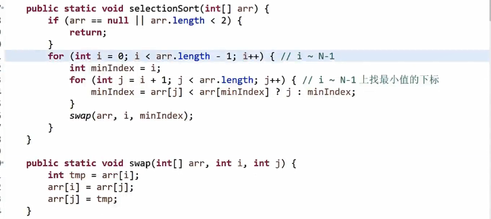


有限几个变量，i，minIndex，j，因此==额外空间复杂度：O（1）==

### ==3）swap方法的新写法（用异或运算）==

前提，a，b指向的内存是固定的两块东西。内存空间为==不同位置==


* ##### 注意，这里int i 和 int j 千万不能相等，若是相等就会指向内存空间中的==相同位置==。


而这里 虽然 a和b 的值是相等的，但是a 和 b 都是 独立的两个部分。


==异或运算==：可以理解为无进位相加，即个数位上相加，不考虑进位上的数。


第二位，1+1=0 ，其进位有个1，但不考虑。

* #### 异或运算的性质

  ① 0 ^ N = N;     N ^ N = 0;

  ②满足**交换律**、**结合律** ：

  <center>a ^ b = b ^ a</center>

  <center>a ^ b ^ c = a ^ ( b ^ c)</center>

  

  ​		


### 4）异或运算例题

#### 情况1：一个数组中，仅一个数出现奇数次，其他数出现偶数次

目标：找出这个奇数次的数


* ##### 最后这个 eor 就是出现了==**奇数次**的数==


解释：


#### 情况2：只有2种数出现奇数次，其余出现偶数次。

目标，找到这两个出现奇数次的数。


##### 第一步理解

eor所有数组元素后，得到eor = a ^ b

∵ a ≠ b，∴ a ^ b ≠ 0，∴ eor的二进制数位上一定有一位是 不等于 0 的。


##### 第二步理解

数组中的数：a，b，others

用 eor‘ 去**异或**那些数位上==不是1的数==，所以eor’得到了 a 或者 b

假设，在得到eor的第8位上不等于0（即，为1），那么就是说a和b在第八位上是**不相等的**。

* ##### others分成两类

原数组中出现偶数次的others部分的第八位分成两类，一部分other1的第八位是1，另一部分other2的第八位是0。

所求的a和b只能是分别出现other1或other2中，才满足第八位两者是不相等的。

假设此时a落在第八位是1的集合中。eor’ 只去 异或 第八位上是1的数，那最后得到的eor‘ = a

因为，other1是出现偶数次的数的集合，那么就是偶数次个第八位的1，他们被异或后全部被成0，最后a的第八位是1，那么得到的就是a。

那么，显然eor ^ eor’ 就能得到另外一个

```java
public static void printNum(int[] arr){
        int eor = 0;
        for (int i = 0; i < arr.length; i++){
            eor ^= arr[i];
        }
        // eor = a ^ b
        // eor != 0
        // eor 必然有一个位置上是1
        int rightOne = eor & (~eor + 1); //提取出eor中最右侧的1

        int onlyOne = 0;//eor’
        for (int cur : arr) {
            //用 （……）== rightOne 可以匹配出用作分类的那位，那位上为1的所有元素
            //用 （……）== 0 可以匹配出用作分类的那位，那位上为0的所有元素
            if ((cur & rightOne) == rightOne) {
                onlyOne ^= cur;
            }
        }
        System.out.println(onlyOne + " " + (eor ^ onlyOne));
    }
```


onlyOne就是我们先前所说的eor’，第二部分的if里的意思就是，onlyOne去与上那些二进制数位上最右=1 的数。这里我们按照最右的1用作分类，即对应前面所提到的第8位不同的情况。

提取一个不等于0的数的最右侧的1：一个数 & （自己的取反+1）


### 5）插入排序案例分析

#### ==插入排序的算法规则：==

当前位置比左边的位置的元素要小，则两者交换

#### **流程分析**

①欲使，索引 0~0 有序，显然已经完成


②欲使，索引 0~1有序，arr[1] < arr[0]; 则交换，交换完后如下图所示

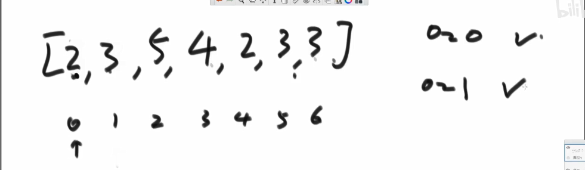


③欲使，索引 0~2有序，从索引2开始看，arr[2] = 5 > arr[1]=3, 因此不用再往前比较的。因为索引 0~1是在整个数组中局部有序，范围中的最右侧是该数组中最大元素。


④ 欲使，索引 0~3有序，从索引3开始看（原始情况在上图中），我们将4和5进行交换，交换后来到4的位置，需要比较当前位置是不是比其前面，即索引0~1的都大。


⑤ 0 ~ 4有序


⑥ 0 ~ 5有序


⑦ 0 ~ 6 有序


#### 插入排序的时间复杂度分析

其时间复杂度与先前提到的几种排序些许不同，前面几种排序的排序规则，与数据的情况无关，每次执行的比较、交换的流程次数都一样。

而，插入排序跟所提供的数据的数据情况（表现）有关。

说明如下，

最糟糕的情况：

给一个 7，6，5，4，3，2，1的数组用于排序。此时，其时间复杂度是O($N^2$)。

最舒服的情况：

给一个1，2，3，4，5，6，7的数组用于排序。此时，其时间复杂度O(N).


但我们对算法的时间复杂度分析都是按照其最差情况来进行评估的，因此，我们认为插入排序的时间复杂度是O($N^2$)。

#### 插入排序的实现

插入排序，实际运行过程中比冒泡和选择排序好点，因为其最差情况才跟他们一样。

```java
  public static void insertSort(int[] arr){
      //0~0 天然有序，故i从1开始
      //第一层for循环：欲使 0 ~ i 是有序的
        for (int i = 1; i < arr.length; i++) {
            //第二层循环：筛选排序
//            for (int j = i - 1; j >= 0; j--) {
//                if(arr[j+1] < arr[j]){
//                    swap(arr,j,j+1);
//                } else {
            		//前面已经局部有序了
//                    break;
//                }
//            }
            //优化上面注释后：利用for（……；条件表达式；），其中的条件表达式式每一次循环都会判断一次，故我们把每次要进行判断的if内容直接放入for循环的条件表达式。满足，才会进入本次循环，不满足则不进入，等效于进去后又break出来。
            for (int j = i - 1; j >= 0 && arr[j] > arr[j+1]; j--) {
                    swap(arr,j,j+1);
            }
        }
        }
    }
```

排序结果从小到大：取决于排序规则`arr[j] > arr[j+1]`

排序结果从大到小：修改排序规则为`arr[j] < arr[j+1]`

### 6）二分法

O($log_2{N}$) 

```java
//在一个排序数组中，统计一个数字在排序数组中出现的次数：二分法
class Solution {
    public int search(int[] nums, int target) {
        //找寻左右边界的关键：取 等号 时，哪个可移动，那个停下来的时候就是某一侧的边界。
        // 搜索右边界 right
        int i = 0, j = nums.length - 1;
        while(i <= j) {
            int m = (i + j) / 2;
            if(nums[m] <= target) i = m + 1;
            else j = m - 1;
        }
        // 若数组中无 target ，则提前返回
        if(i >= 1 && nums[i - 1] != target) return 0;

        int right = i;
        // 搜索左边界 right
        i = 0; j = nums.length - 1;
        while(i <= j) {
            int m = (i + j) / 2;
            if(nums[m] < target) i = m + 1;
            else j = m - 1;
        }
        int left = j;
        return right - left - 1;
    }
}
```

例题：

arr数组中，元素无序，但相邻数一定不相等，找局部最小，时间复杂度要好于O(N)。

==局部最小的定义：==

索引 ： ~ i-1， i， i+1，~

i 位置上的元素，小于 i-1位置上的元素 也小于i + 1上的元素。

* 注意：下面的N表示元素的个数，因此索引范围 0 ~ N-1 

* ① 如果索引位置 0 上的元素是==局部最小的==，就直接返回。

​					若它不是局部最小的，那么索引 0 -> 1 的元素的值是非严格单调递减。

* ② 如果索引位置 N-1 上的元素是==局部最小的==，就直接返回。

​					若它不是局部最小的，那么索引 N-1 -> N-2的元素的值是非严格单调递减的。

​					==对上面①、②两点的说明==：根据我们先前对局部最小的定义，来说明①、②的正确性。


​					显然，index: 0处的左侧是没有值的，因此只要index: 0处 小于 index: 1处的	     	值，那么就满足范围 index: 0 ~ 1 上是局部最小的。

​					显然，index: N-1 处的右侧是没有值的，因此只要index: N - 1处 小于 index: N 	- 2处的值，那么就满足范围 index: N-1 ~ N-2 上是局部最小的。

* ③: 若① 和 ②不成立，那么就如下图所示，我们可知 0 ~ N-1的索引范围内必存在局部最小。


以下在为在③的成立情况下，继续深入寻找：

找中点M，如果 M 在 M-1 和 M+1 之间是 局部最小的则返回，否则则继续寻找。

不妨假设 M 比 M-1 处的大：


则 索引 0 ~ M-1 或者 M+1 ~ N-1 上必定存在局部最小：

二分到死则一定能到一个局部最小的。


### 7）对数器

随机样本产生器

```java
	public static int[] generateRandomArray(int maxSize, int maxValue) {
     //注意，等概率返回，考虑到小数是无穷尽的，因此在数学的角度上是做不到的，而在计算机中的数据类型都右其各自的精度，因此在计算机中是可以做到等概率返回，因为数个个数是确定的。
    //Math.random() -> [0,1) 所有的小数，等概率返回一个
    //Math.random() * N -> [0,N) 所有小数，等概率返回一个
    //(int)(Math.random() * N) -> [0,N-1] 所有的整数，等概率返回一个。
		int[] arr = new int[(int) ((maxSize + 1) * Math.random())]; //实现数组的长度随机， [0,maxSize]之间
		for (int i = 0; i < arr.length; i++) {
			arr[i] = (int) ((maxValue + 1) * Math.random()) - (int) (maxValue * Math.random());//实现数组中的值随机
		}
		return arr;
	}

	// for test
	public static int[] copyArray(int[] arr) {
		if (arr == null) {
			return null;
		}
		int[] res = new int[arr.length];
		for (int i = 0; i < arr.length; i++) {
			res[i] = arr[i];
		}
		return res;
	}
	//实测演示
	public static void main(String[] args) {
		int testTime = 500000;
		int maxSize = 100;
		int maxValue = 100;
		boolean succeed = true;
		for (int i = 0; i < testTime; i++) {
			int[] arr1 = generateRandomArray(maxSize, maxValue);
			int[] arr2 = copyArray(arr1);
            //此处方法几仅用于区分此时有2个不同方法实现排序
			insertionSort(arr1);//方法1排序
			comparator(arr2);.//方法2排序
			if (!isEqual(arr1, arr2)) {
				succeed = false;
				break;
			}
		}
		System.out.println(succeed ? "Nice!" : "Fucking fucked!");

		int[] arr = generateRandomArray(maxSize, maxValue);
		printArray(arr);
		insertionSort(arr);
		printArray(arr);
	}

}
```

### 8）求最大值（递归法）

```java
public class Code08_GetMax {

	public static int getMax(int[] arr) {
		return process(arr, 0, arr.length - 1);
	}

	public static int process(int[] arr, int L, int R) {
		if (L == R) { //arr[L...R]范围上只有一个数，直接返回
			return arr[L];
		}
        //解决了，相加除以2求中点方式会导致int型数据溢出
		int mid = L + ((R - L) >> 1);
        
		int leftMax = process(arr, L, mid);
		int rightMax = process(arr, mid + 1, R);
		return Math.max(leftMax, rightMax);
	}

}
```


==先左后右，悬而未决的东西先压入栈，算完后再出栈。== 

<font color = red>本质</font>: 利用栈玩了一个==后序遍历==。


#### 递归行为的时间复杂度分析

master公式，适用于某一类特殊的递归行为的时间复杂度分析

剖析递归行为和递归行为时间复杂度的估算
用递归方法找一个数组中的最大值，系统上到底是怎么做的？
master公式的使用
T(N) = a*T($\frac{N}{b}$​) + O($N^d$​)

就看第一层，结合上面求最大值的例子来说明：

其中，子问题调用以外的剩余过程就`int mid = L + ((R - L) >> 1);`和`		return Math.max(leftMax, rightMax);` 其时间复杂度是O(1)；


**符号说明**

N：母问题的数据量。

$\frac{N}{b}$: 表示子问题都是$\frac{1}{b}$​​规模的。==都是等规模的==

a：表示子问题被调了多少次数。

O($N^d$): 表示子问题的调用之外，其余的过程的时间复杂度

1) $log_ba$​ > d -> 复杂度为O($N^{log(b,a)}$​​​)
2) $log_ba$ = d -> 复杂度为O($N^d$ * logN})
3) $log_ba$ < d -> 复杂度为O($N^d$)
补充阅读:www.gocalf.com/blog/algorithm-complexity-and-master- theorem.h


# 二、排序（含BST的delete操作）

## 认识O(NlogN)的排序

### 1)归并排序


```java
public class Code01_MergeSort {

	public static void mergeSort(int[] arr) {
		if (arr == null || arr.length < 2) {
			return;
		}
		mergeSort(arr, 0, arr.length - 1);
	}
	/**
		遍历，把大数组拆成小数组的作用，直到分不下去为止，什么叫分不下去？
		就是一个数组，我们继续对半拆开两个，两个都只有单个元素。
	*/
	public static void mergeSort(int[] arr, int l, int r) {
		if (l == r) {//当数组只剩1个元素时，显然是满足有序的。那就啥也不做直接return
			return;
		}
		int mid = l + ((r - l) >> 1);
		mergeSort(arr, l, mid);//让左半边有序，当数组只剩1个元素时，显然是满足有序的。
		mergeSort(arr, mid + 1, r);//让右半边有序，当数组只剩1个元素时，显然是满足有序的。
		merge(arr, l, mid, r);//将左右半边合并一起
	}

	public static void merge(int[] arr, int l, int m, int r) {
		int[] help = new int[r - l + 1]; //某一层里的merge时，根据该层的实际数据量大小，创建一个辅助空间。
		int i = 0;//i是给help空间遍历用的指针
		int p1 = l; //左半边空间的初始下标
		int p2 = m + 1; //右半边空间的初始下标
		while (p1 <= m && p2 <= r) {//跳出该循环后，p1、p2里有一个是跳出自身范围的
			//p1不超过m，p2不超过r表示没有越界
		//在不越界的情况下，比较两边空间索引对应下的值，谁小谁先存放到辅助空间里
			help[i++] = arr[p1] < arr[p2] ? arr[p1++] : arr[p2++];
		}
		while (p1 <= m) {//此时，p2跳出，p1还有剩余，将剩下的继续拷贝到辅助空间中
			help[i++] = arr[p1++];
		}
		while (p2 <= r) {//此时，p1跳出，p2还有剩余，将剩下的继续拷贝到辅助空间中
			help[i++] = arr[p2++];
		}
		for (i = 0; i < help.length; i++) {
			arr[l + i] = help[i];
		}
	}
```


### 2）归并排序的扩展

#### 扩展1：小和问题

归并排序的扩展

小和问题和逆序对问题
小和问题

在一个数组中，每一个数左边比当前数小的数累加起来，叫做这个数组
的小和。求一个数组 的小和。
例子:[1,3,4,2,5] 1左边比1小的数，没有; 3左边比3小的数，1; 4左
边比4小的数，1、3; 2左边比2小的数，1; 5左边比5小的数，1、3、4、
2; 所以小和为1+1+3+1+1+3+4+2=16


上图就是修改了题目描述方式（原题是右往左看，上图是左往右看），但是结果不变。


==相等时，右组先拷贝==

==注意==，当左组索引对应的数==等于==右组索引对应的数，我们要先把右组索引对应的数存到辅助空间中。如果先存左组的，那么我们就不能通过右组的当前位置到尾巴的距离来判断出到底有多少个右组的元素比左组当前索引对应的元素大，即不能判断此时有多少个左组当前索引对应的元素的==小和==。


任意一个数==既不漏算==（比如C，右边都比完），==也不重算==（比如C，比完后就merge排序进左组，而左组的数内部是不会==再次==产生小和的，左右跨着比较才会有小和产生）

代码：

```java
public class Code02_SmallSum {

	public static int smallSum(int[] arr) {
		if (arr == null || arr.length < 2) {
			return 0;
		}
		return mergeSort(arr, 0, arr.length - 1);
	}
	
	//arr[L...R]既要排好序，也要求小和
	public static int mergeSort(int[] arr, int l, int r) {
		if (l == r) { //l==r的时候，小和为0也不需要排序
			return 0;
		}
		int mid = l + ((r - l) >> 1);
		return 
		//左边求小和的数量
		mergeSort(arr, l, mid) + 
				//右边求小和的数量
				mergeSort(arr, mid + 1, r) + 
				//merge后求小和的数量
				merge(arr, l, mid, r);
	}

	public static int merge(int[] arr, int l, int m, int r) {
		int[] help = new int[r - l + 1];
		int i = 0;
		int p1 = l;
		int p2 = m + 1;
		int res = 0;
		while (p1 <= m && p2 <= r) {
			//保证严格左<右的时候才将p1对应的左组元素拷贝到help
			//下面就是产生小和的过程
			res += arr[p1] < arr[p2] ? (r - p2 + 1) * arr[p1] : 0;
			help[i++] = arr[p1] < arr[p2] ? arr[p1++] : arr[p2++];
		}
		while (p1 <= m) {
			help[i++] = arr[p1++];
		}
		while (p2 <= r) {
			help[i++] = arr[p2++];
		}
		for (i = 0; i < help.length; i++) {
			arr[l + i] = help[i];
		}
		return res;
	}
}
```


#### 扩展二：逆序对问题

逆序对问题 在一个数组中，左边的数如果比右边的数大，则这两个数
构成一个逆序对，请打印所有逆序 对

**解题思路：** 与小和问题正好相反，从右往左看，左边有多个数比当前的大，那对于当前的数来说就有多少个逆序对。

小和，统计右边有几个比当前大的。

逆序对，统计右边有几个比当前小的。


### 3）快速排序

#### 问题一

给定一个数组arr，和一个数num，请把小于等于num的数放在数 组的左边，大于num的
数放在数组的右边。要求额外空间复杂度O(1)，时间复杂度O(N)

初始状态


i=0(下图)

3自己和自己交换


i=1(下图)

5自己和自己交换，<=区 扩大，然后i跳到下一个


i=2


i=3


i=4


i=5


i=6

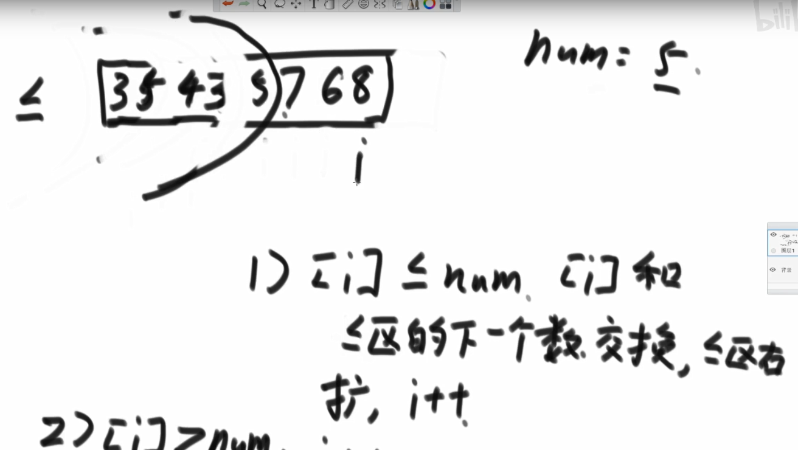


i=7


==本质分析==


相当于小于等于的区域，一直推着大于区域往后面走


#### 问题二(荷兰国旗问题)

给定一个数组arr，和一个数num，请把小于num的数放在数组的 左边，等于num的数放
在数组的中间，大于num的数放在数组的 右边。要求额外空间复杂度O(1)，时间复杂度
O(N)

问题1的升级版

下图为我们的目的需求


==举例：==


1）[ i ] < num, [ i ] 和 <区（小于num的区域）下一个交换，< 区右扩，然后 i++

2）[ i ] == num, i++

3）[ i ] > num, [ i ] 和 >区 的前一个交换，>区左扩，然后 i 原地不动 （不动的原因是，此时>区前一个换了过来，但是这个数的跟num的大小关系未知，因此 索引i 不动，再次比较一次）

 4）停止条件，i 恰好 撞上 >区；


#### 快排1.0

拿数组最后一个作为我们的num，拿来比较的**基准值**

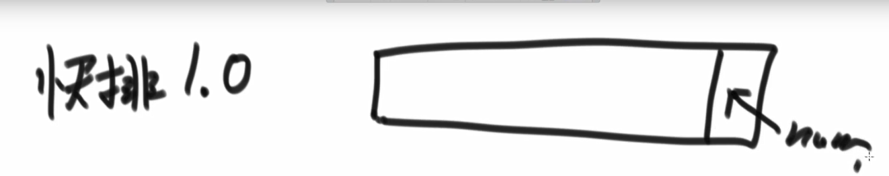

从num前面一个索引 ~ 0，完成 两个区域的扩充


#### 快排2.0


==无论是快排1.0，还是快排2.0，时间复杂度都是O($N^2$​​)==

参考以下最差的情况，


#### 快排3.0 final!

时间复杂度：O(N*logN)

额外空间复杂度：O(logN) （最差是O（N））

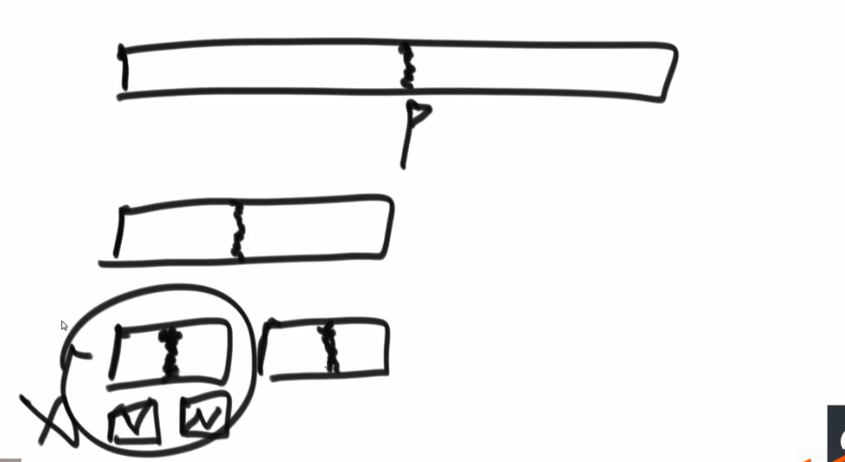

恰好每次都中间分，分成 [] [] 这种就over了，这种好情况比归并少了一层，所以是额外空间复杂度是O(logN)

```java
public class Code06_QuickSort {

	public static void quickSort(int[] arr) {
		if (arr == null || arr.length < 2) {
			return;
		}
		quickSort(arr, 0, arr.length - 1);
	}

	public static void quickSort(int[] arr, int l, int r) {
		if (l < r) {
			//排序前预备工作：等概率随机选一个位置，把他跟最右侧的数做交换，然后将这个数作为 比较的基准值。
			swap(arr, l + (int) (Math.random() * (r - l + 1)), r);
			//返回的数组p长度一定为2，两个元素分别表示划分区域的左边界跟右边界
			int[] p = partition(arr, l, r);//在调整后的数组中进行partition
           //p[0]  到 p[1]  之间的值 都是 等于 用作比较的基准值。
			quickSort(arr, l, p[0] - 1);//p[0]，<区，小于区的右边界
			quickSort(arr, p[1] + 1, r);//p[1]，>区，大于区的左边界
		}
	}

	public static int[] partition(int[] arr, int l, int r) {
        //定义两个指针，作为返回
		int less = l - 1;// less是小于区的指针
		int more = r;// more是大于区的指针
        int i = l； // 数组索引的指针
        /**
			1）[ i ] < num, [ i ] 和 <区（小于num的区域）下一个交换，< 区右扩，然后 i++
			2）[ i ] == num, i++
			3）[ i ] > num, [ i ] 和 >区 的前一个交换，>区左扩，然后 i 原地不动 （不动的原因是，此时>区前一个换了过来，但是这个数的跟num的大小关																						系未知，因此 索引i 不动，再次比较一次）
			4）停止条件，i 恰好 撞上 >区；
        */
		while (i < more) {// 这里用 刚好用 l 作为数组元素的索引指针，可以用一个 int i = l，然后 i++ 来操作更容易理解
			if (arr[i] < arr[r]) {
				swap(arr, ++less, i++);// 先++less，然后新的less和l对应元素做交换，最后l++
			} else if (arr[i] > arr[r]) {
				swap(arr, --more, i);// l 不动，下一轮的时候还得附加比一次，以防换过来的数是大于基准值的
			} else {
				i++;
			}
		}
        //调整基准值的位置
		swap(arr, more, r); //more --> 最后是大于区域的左侧第一个索引，r--->对应基准值的位置索引
        //上面swap后，more指针对应的元素是 原先的比较值
		return new int[] { less + 1, more };//返回等于区的索引。
	}

	public static void swap(int[] arr, int i, int j) {
		int tmp = arr[i];
		arr[i] = arr[j];
		arr[j] = tmp;
	}
}
```


## 其他排序（含BST的delete操作）

==树的结构== -----> ==数组==


### 1）堆排序

#### 大根堆的概念

**根（or子树的根）是最大的**


#### 大根堆的实现

* ##### 数据来自一个数组

* ##### 根据 heapSize 来确定存入的索引位置


#### heapInsert过程介绍（上浮）


此时，插入一个6，违背的大根堆定义，那么就得知插进来的数要和他的父节点比较一下。


插进来7，跟父节点比，比父节点大，那就换一哈


换到新位置后，又要和父节点PK下，又换了下


又来个7


#### heapInsert代码实现

```JAVA
	public static void heapInsert(int[] arr, int index) {
		while (arr[index] > arr[(index - 1) / 2]) {
			swap(arr, index, (index - 1) /2);
			index = (index - 1)/2 ;
		}
	}
```

* ##### while的条件：1含2

① 值的比较大小：==停在一个大小合适的位置==

② 当index 到0，自己跟自己比，肯定是会跳出的。==到了根就不动了==


#### heapIfy过程介绍（下沉）


给了6个数，用户就不给了，然后要我们把最大值去掉，返回。


第一步：记录原始的根结点6（用于返回），然后把最后一个结点（4）替代原根结点（6）


擦掉联系


第二步：新的根结点下沉，跟他的【孩子结点们的最大值】比较

断子绝孙的时候该停停了，or孩子们都不够大也该停停了喂

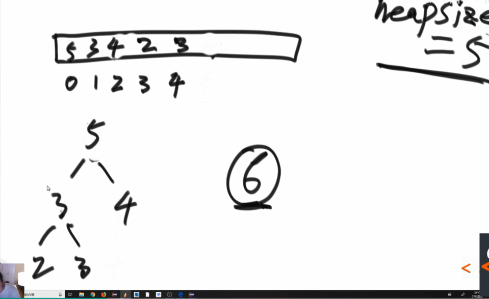


#### heapIfy代码实现

```JAVA
//某个数在index位置，能否往下移动
public static void heapify(int[] arr, int index, int size) {
		int left = index * 2 + 1;//左孩子的下标
		while (left < size) {// 下方还有左孩子的时候
            // 1.孩子间比一比
            // 两个孩子中，谁的值大，谁把下标交给largeest
			int largest = left + 1 < size && arr[left + 1] > arr[left] ? left + 1 : left;// left + 1 是右孩子的下标
            
            // 2.父子间比一比
            // 父和孩子之间，谁的值大，都把下标给largest
			largest = arr[largest] > arr[index] ? largest : index;
            
            // 3.如果一通比，最大值就是现在的位置，那后面就啥也别干了
            //说明当前的就是父子环境中最大的，index不用往下走
			if (largest == index) {
				break;
			}
			swap(arr, largest, index);
			index = largest;//更新当前位置
			left = index * 2 + 1;
		}
	}
```


#### ==用户一个诡异的、最常见需求==

调整的代价（时间复杂度）：O(logN)

在堆中任意位置插入后，还得保证是大根堆的结构。

① 插入的值，是比原来的大还是小呢？

② 若大，那么就将其上浮(heapInsert)；若小(heapIfy)，那就就将其下沉


#### ==堆排序的实现==

题目要求：数组中的数是一个个给的，不是一股脑给的，所以要用for循环的形式来模拟数组中的数字范围是逐个增加的


通过下述代码的部分2，得到根据原始数据构造的大根堆


上图是 0、9互换后的结果，并heapSize - - 来去掉9的联系

```java
public static void heapSort(int[] arr) {
    	// 1. 排除非法情况
		if (arr == null || arr.length < 2) {
			return;
		}
    
    	// 2. 将数组，排成大根堆
    	// 循环，依次让 0~i 范围内是大根堆；最终完成整个大根堆
		for (int i = 0; i < arr.length; i++) { //O(N)
			heapInsert(arr, i); //O(logN)
		}
		int size = arr.length;
    
    	// 3. 实现需求，去掉最大值（即，当前的根结点）
    	/**
    	实现方式：将根结点与堆最后一个节点互换，然后size - 1
    	*/
		swap(arr, 0, --size);//0位置跟堆上最后一个元素交换
    
   	 // 4. 删除节点后，可能破坏当前大根堆特性，因此接下来进行维护：下沉新得到的根结点
		while (size > 0) { //O(N)，调完一轮，继续将最大值（也就是原来的次大值）拿出去，
            //下沉到底部
			heapify(arr, 0, size); //O(logN)
			swap(arr, 0, --size); //O(1)
		}
	}
```


优化的一种方式：数据不是个个给的，是一次性给完的。

图中的for（O(N)）比之前的for(O(N*logN))快


#### 堆排序扩展题目


假设k=6, 那么能成为小根堆的最小值，只可能是在索引范围0~6之间的7个数（如果索引0不符合，那么就得从外边调，调的长度超过k=6，因此最多从索引6（第七个数）调过来）


==使用小根堆==

java中小根堆可以不用自己通过代码实现，直接 new PriorityQueue<>();

不带任何参数的优先队列就是默认小根堆的结构。使用的升序的比较器，

当我们传一个降序的比较器作为参数，就可以实现大根堆。


这是个**黑盒**，

我给黑盒add一个，黑盒就给我poll一个，不能破坏其原始堆结构（不能更改）

```java
public class Code04_SortArrayDistanceLessK {

	public void sortedArrDistanceLessK(int[] arr, int k) {
        // 默认小根堆（JAVA中）
		PriorityQueue<Integer> heap = new PriorityQueue<>();
		int index = 0;
        //把 k+1 个数放到数组中去
        //min的原因，万一k很大，超过了数组长度就不好了
		for (; index <= Math.min(arr.length, k); index++) {
			heap.add(arr[index]);
		}
        
		int i = 0;
		for (; index < arr.length; i++, index++) {
            //第一次add是原位置被原值覆盖，不变化
			heap.add(arr[index]);
			arr[i] = heap.poll();
		}
		while (!heap.isEmpty()) {
			arr[i++] = heap.poll();
		}
	}
}

```


### 2）比较器

利用Array.sort();

```JAVA
public class Code03_Comparator {

	public static class Student {
		public String name;
		public int id;
		public int age;

		public Student(String name, int id, int age) {
			this.name = name;
			this.id = id;
			this.age = age;
		}
	}
	//ID升序比较器
	public static class IdAscendingComparator implements Comparator<Student> {
		// 根据compare返回的结果，确定比较器的规则
        // 以下是默认的规则,即比较策略 ----->从小到大
        /**
        想要从小到大，那么加入o1小，那么就让o1在前，那么o1.id - o2.id 的式子返回值为负数，就符合我们默认规则的“要让第一个参数在前，就要返回负数”。
        */
        // 返回负数的时候，第一个参数在前面：Student o1
        // 返回正数的时候，第二个参数在前面：Student o2
        // 返回0的时候，谁在前面无所谓
		@Override
		public int compare(Student o1, Student o2) {
            /**
            这段代码用于理解
            
            if(o1.id < o2.id) {
                return -1;
            }
            if(o2.id < o1.id) {
                return 1;
            }
            return 0;
            
            */
			return o1.id - o2.id;
		}

	}
	
    //ID降序比较器
	public static class IdDescendingComparator implements Comparator<Student> {

		@Override
		public int compare(Student o1, Student o2) {
			return o2.id - o1.id;
		}

	}
	
    //Age
	public static class AgeAscendingComparator implements Comparator<Student> {

		@Override
		public int compare(Student o1, Student o2) {
			return o1.age - o2.age;
		}

	}

	public static class AgeDescendingComparator implements Comparator<Student> {

		@Override
		public int compare(Student o1, Student o2) {
			return o2.age - o1.age;
		}

	}

	public static void printStudents(Student[] students) {
		for (Student student : students) {
			System.out.println("Name : " + student.name + ", Id : " + student.id + ", Age : " + student.age);
		}
	}

	public static void printArray(Integer[] arr) {
		if (arr == null) {
			return;
		}
		for (int i = 0; i < arr.length; i++) {
			System.out.print(arr[i] + " ");
		}
		System.out.println();
	}

	public static class MyComp implements Comparator<Integer> {

		@Override
		public int compare(Integer o1, Integer o2) {
			return o2 - o1;
		}

	}
```

### 3）桶排序（基数排序）

桶是一个容器，可以是数组、栈、队列等数据结构，这里我们用队列充当桶

<center><font size = 4 color=red>按照数字的进制位数来确定桶的个数</font></center>

#### 过程举例

① 数据放进桶里，根据数字的个位【第一轮】


② 把桶，从左往右依次倒出来（先进桶的先出桶）【第一轮】


③又放进桶里面，根据数字的十位【第二轮】


④又从桶里倒出来【第二轮】


⑤最后，按照百位数字进桶


⑥所有数字倒出来


<font color=red>总结</font>：高位数的优先级最高，他是最晚排序的，因此最后可以看见数组是从小到大的


数组中的数字表示以下面索引为结尾的个数有多少个


改变后的数组（经过累加），个数数字小于等于该索引值的数有多少个。


看062属于哪个索引，首先它属于个位数小于等于2的范围，那么把它从数组中从右往左倒出来的话他就是处于索引4-1的位置上，是在小于等于2的范围里的最右侧边界的索引处对应的元素。

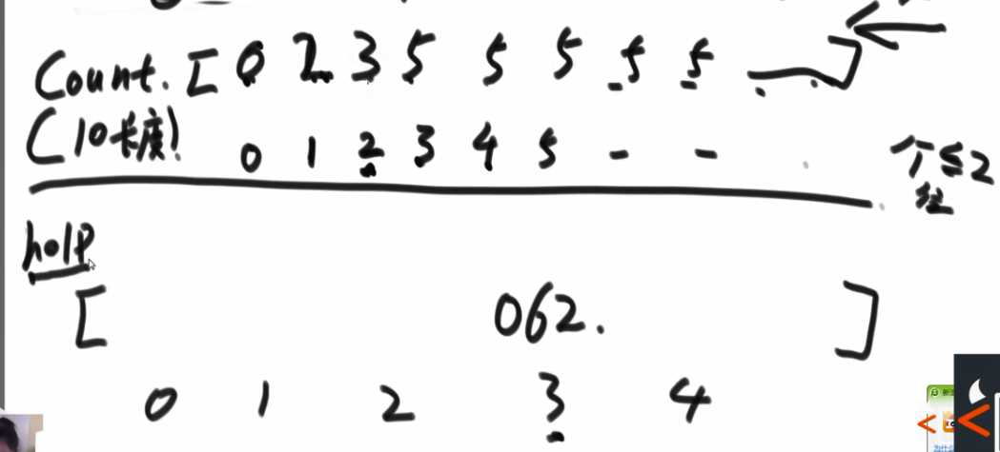


取出062后在原数组中将4变成3


继续看052

属于小于等于2，有3个这样的数，他也是在最右侧，从右往左出桶的话，那么对应在索引3-1的位置。取出后调整其词频变成2


继续看011

属于小于等于1，


继续看021


最后看013


#### 代码实现

```JAVA
public class Code02_RadixSort {

	// only for no-negative value
	public static void radixSort(int[] arr) {
		if (arr == null || arr.length < 2) {
			return;
		}
		radixSort(arr, 0, arr.length - 1, maxbits(arr));
	}

	public static int maxbits(int[] arr) {
		int max = Integer.MIN_VALUE;
		for (int i = 0; i < arr.length; i++) {
			max = Math.max(max, arr[i]);
		}
		int res = 0;
		while (max != 0) {
			res++;
			max /= 10;
		}
        //最大值的十进制位 位数，他决定了元素进出桶的次数
		return res;
	}
	//arr[begin .. end] 排序
	public static void radixSort(int[] arr, int begin, int end, int digit) {
		final int radix = 10;
		int i = 0, j = 0;
		//有多少个 数就准备多少个辅助空间
		int[] bucket = new int[end - begin + 1];
		for (int d = 1; d <= digit; d++) { // 有多少位就进出多少次
            // 10个空间
            // count[0] 当前位(d位)是0的数字有多少个
            // count[1] 当前位(d位)是(0和1)的数字有多少个
            // count[2] 当前位(d位)是(0、1、2)的数字有多少个
            // count[i] 当前位(d位)是(0 ~ i)的数字有多少个
			int[] count = new int[radix];
			for (i = begin; i <= end; i++) {
				j = getDigit(arr[i], d);//d=1该方法的作用就是取出个位数字，d=2对应取十位，d=3对应取出百位数字
				count[j]++;
			}//所有元素入桶了
            //累加和，得到前缀和数组，每个索引下的值表示小于等于当其索引值的数有多少个
			for (i = 1; i < radix; i++) {
				count[i] = count[i] + count[i - 1];
			}
            //数组从 右→左 遍历，
			for (i = end; i >= begin; i--) {
				j = getDigit(arr[i], d);//找第几位，就取出第几位的值，然后再拿去给辅助数组bucket用
				bucket[count[j] - 1] = arr[i];
				count[j]--;
			}//结束后，所有元素出桶了
			for (i = begin, j = 0; i <= end; i++, j++) {
				arr[i] = bucket[j];
			}//将本次出入桶后的结果维护到arr中，为下一次出入桶做准备
		}
	}

	public static int getDigit(int x, int d) {
		return ((x / ((int) Math.pow(10, d - 1))) % 10);
	}
}
```


## 排序算法的稳定性及其汇总


* **稳定性**：值相同的元素在排序完成后，是否可以保证原来的相对次序不变

如图，虽然有两个==1==，但是如何保证①对应的1在排完后，仍然在②对应的==1==前面，这就是稳定的。

### 排序算法是否稳定的例子说明

①==选择不是稳定的：==

3换了之后就不稳定了


②==冒泡是稳定的：==


③==插入是稳定的==：

控制相等的时候不换就稳定了


④==归并是稳定的==

控制相等的时候先copy左边的刀辅助数组


⑤==快排是不稳定的：==

这个6跨到后边的6了

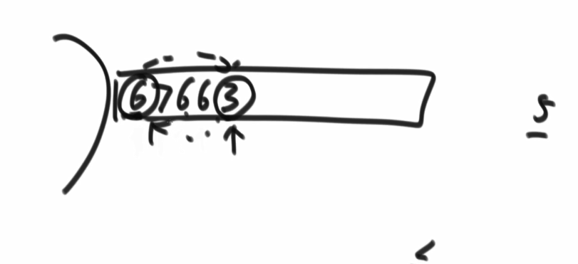


⑥==堆排序是不稳定的==

4变动位置后就已经失去稳定性了


⑦ ==基数排序是稳定的==

因为，先入桶就先出桶，必然是有序的


### 总结表


这里的快排是指前面的快排3.0版本。

排序的时候，能用快排就用快排。

考虑到稳定性的时候，再去用归并。

（1）基于比较，时间复杂度低于O(N*logN)的排序有没有？

   答案：没有。

（2）时间复杂度为O(N*logN)，其空间复杂度要低于O(N)，还要求稳定的排序，有没有？

​	答案：没有。


### ==<font color=red>排序算法学习过程中常见的坑</font>==


坑1：虽然额外空间复杂度变成O(1)，但是这样的归并排序会丧失稳定性，那为什么不直接用堆排序呢？

坑2：归并的时间复杂度变成了O($N^2$)，为什么不直接插入or冒泡排序呢？

坑3：快排变稳定了，空间又会上升的O(N)，那为什么不直接用归并呢？


### 工程上对排序的改进


大样本 快排 O(N*logN) 

小样本 插入 O($N^2$​​) 

小样本（小于60）插入会更快，受到的瓶颈影响更小


系统的Arrays.sort():

对传入的参数，如果是基础类型则采取快排

对非基础类型的数据就采取归并（稳定）

这是考虑到两种算法的是否具有稳定性的特点。


# 三、链表

### 基础概念


基础类型在哈希表内部是按照值来传递的，会在内存中申请一个区域，然后会再拷贝一份

引用类型在哈希表内部是记录该对象的内存地址，一律只占八字节。

==区别就是==，基础类型如果比如来个String很长很长的，那么对增大很多空间消耗，但如果是个引用类型，不管这个引用类型多大，都是开辟一个8字节空间，里面仅仅装着这个对象的地址。


### 面试时链表解题的方法论


### ① 例题1：单链表的回文


#### 笔试的方法

从头到尾遍历链表，放到栈里。

然后栈一个个弹出，模拟了从后往前遍历链表的过程。

然后进行比对，链表从头往后；同时栈内元素逐个弹出

有一个不一样就不是回文

```java
// need n extra space
public static boolean isPalindrome1(Node head) {
	Stack<Node> stack = new Stack<Node>();
	Node cur = head;
	while (cur != null) {
		stack.push(cur);
		cur = cur.next;
	}
	while (head != null) {
		if (head.value != stack.pop().value) {
			return false;
		}
		head = head.next;
	}
	return true;
}
```


#### ==省一点空间的方法==：快慢指针

只把右侧的放到栈内


如何实现只把右侧的放到栈内呢？


==快慢指针==

快指针一次走2步，慢指针一次走1步；当快指针走完链表的时候，慢指针恰好停在链表整个结构的中点位置。

然后慢指针++直到末尾这段全都放到栈里去

实战的时候考虑下图中的边界情况。

（解决方法：快/慢 指针提前都上一两步）


```java
	// need n/2 extra space
	public static boolean isPalindrome2(Node head) {
		if (head == null || head.next == null) {
			return true;
		}
		Node right = head.next;
		Node cur = head;
		while (cur.next != null && cur.next.next != null) {
			right = right.next;
			cur = cur.next.next;
		}
		Stack<Node> stack = new Stack<Node>();
		while (right != null) {
			stack.push(right);
			right = right.next;
		}
		while (!stack.isEmpty()) {
			if (head.value != stack.pop().value) {
				return false;
			}
			head = head.next;
		}
		return true;
	}
```


#### 面试更好的方法：


首先，快指针走完，慢指针来到中点的位置。

接下来，中点之后，遍历的时候进行逆序操作。


​	3指向null，好比单向链表的最后一个结点

​	2指向3；

​	1指向2；

用A、B分别记录两端头，然后往中间走，每个位置都进行比对，若不一样就不是回文。


最后在返回前，记得回复链表原有结构。

```java
	// need O(1) extra space
	public static boolean isPalindrome3(Node head) {
		if (head == null || head.next == null) {
			return true;
		}
		Node n1 = head;
		Node n2 = head;
		while (n2.next != null && n2.next.next != null) { // find mid node
			n1 = n1.next; // n1 -> mid
			n2 = n2.next.next; // n2 -> end
		}
        
        
		n2 = n1.next; // n2 -> right part first node
		n1.next = null; // mid.next -> null
		Node n3 = null;
		while (n2 != null) { // right part convert
			n3 = n2.next; // n3 -> save next node
			n2.next = n1; // next of right node convert
			n1 = n2; // n1 move
			n2 = n3; // n2 move
		}
        
        
		n3 = n1; // n3 -> save last node
		n2 = head;// n2 -> left first node
		boolean res = true;
		while (n1 != null && n2 != null) { // check palindrome
			if (n1.value != n2.value) {
				res = false;
				break;
			}
			n1 = n1.next; // left to mid
			n2 = n2.next; // right to mid
		}
        
        
		n1 = n3.next;
		n3.next = null;
		while (n1 != null) { // recover list
			n2 = n1.next;
			n1.next = n3;
			n3 = n1;
			n1 = n2;
		}
		return res;
	}
```


### ② 例题2：将单向链表按某值划分成左边小、中间相等、右边大的形式


#### 笔试的做法：


把单链表的每一个结点，放到数组中，然后partition快排。

```JAVA
	public static Node listPartition1(Node head, int pivot) {
		if (head == null) {
			return head;
		}
		Node cur = head;
		int i = 0;
		while (cur != null) {
			i++;
			cur = cur.next;
		}
		Node[] nodeArr = new Node[i];
		i = 0;
		cur = head;
		for (i = 0; i != nodeArr.length; i++) {
			nodeArr[i] = cur;
			cur = cur.next;
		}
		arrPartition(nodeArr, pivot);
		for (i = 1; i != nodeArr.length; i++) {
			nodeArr[i - 1].next = nodeArr[i];
		}
		nodeArr[i - 1].next = null;
		return nodeArr[0];
	}

	public static void arrPartition(Node[] nodeArr, int pivot) {
		int small = -1;
		int big = nodeArr.length;
		int index = 0;
		while (index != big) {
			if (nodeArr[index].value < pivot) {
				swap(nodeArr, ++small, index++);
			} else if (nodeArr[index].value == pivot) {
				index++;
			} else {
				swap(nodeArr, --big, index);
			}
		}
	}

	public static void swap(Node[] nodeArr, int a, int b) {
		Node tmp = nodeArr[a];
		nodeArr[a] = nodeArr[b];
		nodeArr[b] = tmp;
	}
```


#### 面试的方法


如上图，第一次找到符合分区的，将头、尾指针都指向它。


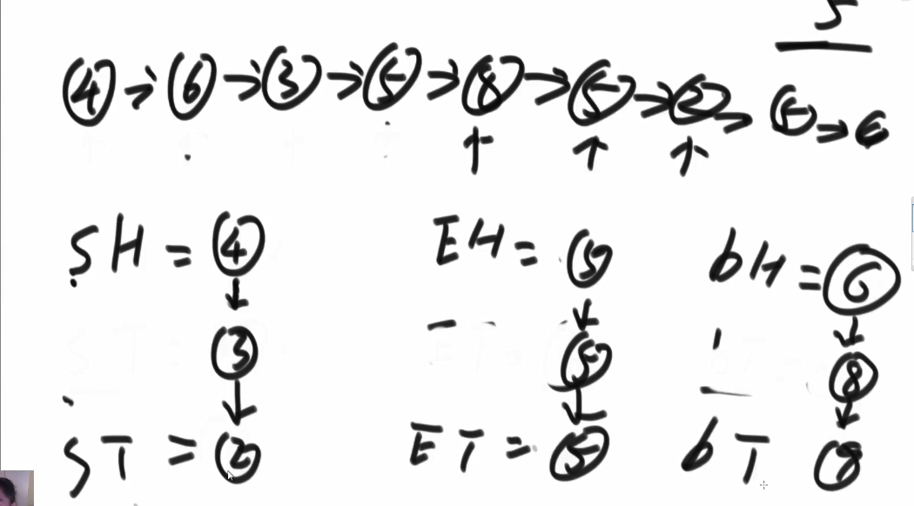

往后再遇到属于一个分区的，则S/E/B分区的链表结构连上新结点，并当ST/ET/BT 这些尾指针都指向新结点。


最后，S区的尾连接E区的头，E区的尾连B区的头。

==注意==：在上述“最后”重新连接的时候，要考虑S/E/B区的头或尾是不是空的，也就是该分区没有元素的情况后，再作连接安排！！！！！

CODE:

```JAVA
	public static Node listPartition2(Node head, int pivot) {
		Node sH = null; // small head
		Node sT = null; // small tail
		Node eH = null; // equal head
		Node eT = null; // equal tail
		Node bH = null; // big head
		Node bT = null; // big tail
		Node next = null; // save next node
		// every node distributed to three lists
		while (head != null) {
			next = head.next;
			head.next = null;
			if (head.value < pivot) {
				if (sH == null) {
					sH = head;
					sT = head;
				} else {
					sT.next = head;
					sT = head;
				}
			} else if (head.value == pivot) {
				if (eH == null) {
					eH = head;
					eT = head;
				} else {
					eT.next = head;
					eT = head;
				}
			} else {
				if (bH == null) {
					bH = head;
					bT = head;
				} else {
					bT.next = head;
					bT = head;
				}
			}
			head = next;
		}
		// small and equal reconnect
		if (sT != null) { // 如果有小于区域
			sT.next = eH;
			eT = eT == null ? sT : eT; //下一步，谁取连大于区域的头，谁就变成eT
		}
        // 上面的if，不管跑了没有，et
		// all reconnect
		if (eT != null) { // 如果小于区域和等于区域，不是都没有
			eT.next = bH;
		}
		return sH != null ? sH : eH != null ? eH : bH;
	}
```


### ③ 例题3：复制含有随机指针结点的链表


#### 笔试的方法


第一轮遍历的时候，把链表中每一个结点copy一个到哈希表中（仅仅创建一个值相同的结点，不设置rand属性）


第二轮遍历的时候再设置rand属性，

遍历老链表，遍历到的结点去哈希表中查出当前结点对应在哈希表汇总的K-V对，拿到key对应的value（即，我们复制出来的结点）。然后设置这个结点rand属性指向的结点（查下老链表的rand在哈希表里的对于元素就行）

```java
	public static Node copyListWithRand1(Node head) {
		HashMap<Node, Node> map = new HashMap<Node, Node>();
		Node cur = head;
		while (cur != null) {
			map.put(cur, new Node(cur.value));
			cur = cur.next;
		}
		cur = head;
		while (cur != null) {
			map.get(cur).next = map.get(cur.next);
			map.get(cur).rand = map.get(cur.rand);
			cur = cur.next;
		}
		return map.get(head);
	}
```


#### 面试的方法

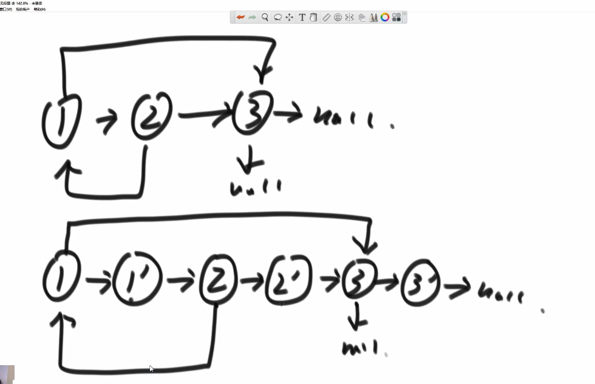

新建结点挂在老链表的相同结点下，这些新结点的rand属性一律先不设置


==最后再分离链表==

CODE:

```java
	public static Node copyListWithRand2(Node head) {
		if (head == null) {
			return null;
		}
		Node cur = head;
		Node next = null;
		// copy node and link to every node
		while (cur != null) {
			next = cur.next;
			cur.next = new Node(cur.value);
			cur.next.next = next;
			cur = next;
		}
		cur = head;
		Node curCopy = null;
		// set copy node rand
		while (cur != null) {
			next = cur.next.next;
			curCopy = cur.next;
			curCopy.rand = cur.rand != null ? cur.rand.next : null;
			cur = next;
		}
		Node res = head.next;
		cur = head;
		// split
		while (cur != null) {
			next = cur.next.next;
			curCopy = cur.next;
			cur.next = next;
			curCopy.next = next != null ? next.next : null;
			cur = next;
		}
		return res;
	}
```


### ④ 例题4：两个单链表相交的一系列问题


==要考虑有没有环==：

<font color = red>每到一个节点，查一查当前结点在不在这个hashset里，不在就加入。第一次出现在的话，说明这个就是入环的结点。</font>如果一直走下去，走到了空节点，那么就是无环的。


快慢指针F/S，先停留在头节点。

若快指针走到空，那么链表一定是没有环的。

#### 下面演示，如果链表有环结构，那么一定快慢指针是会相遇的。

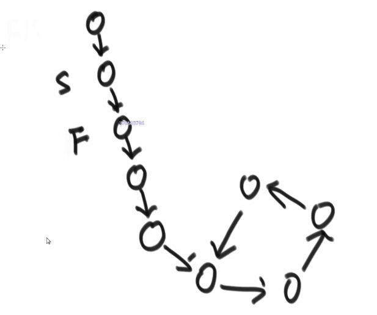


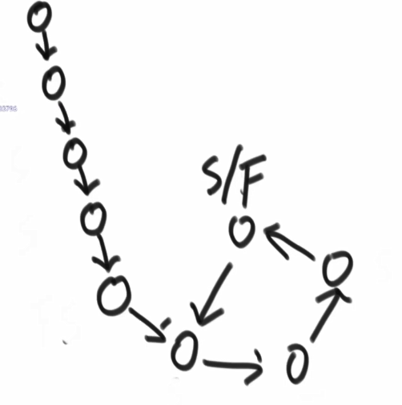

上图，就是F/S指针第一次相遇的时候。


第一次相遇后，快指针回到开头，慢指针停在原地。（如下图所示）


接下来两个指针，==每次都只走一步==。F/S指针接下来一定会相遇，且相遇的位置就是==环的入口处==。


#### ==判断有环的流程==

① 快慢指针，从头结点开始，一个一次2步，一个一次1步，俩指针第一次相遇的结点，停下来作记录。

② 在第一次相遇后，快指针回到开头，一次走1步，慢指针从刚相遇的结点也继续一次走1步，下一次相遇的结点就是==第一个入环的结点处==

* ### 代码实现

```JAVA
	public static Node getLoopNode(Node head) {
		if (head == null || head.next == null || head.next.next == null) {
			return null;
		}
        //先让快慢指针各自先动一脚，不然都从头结点出发岂不是开始就相遇了？那么下面的while条件就没用了噻
		Node n1 = head.next; // n1 -> slow
		Node n2 = head.next.next; // n2 -> fast
		while (n1 != n2) {
			if (n2.next == null || n2.next.next == null) {
				return null;
			}
			n2 = n2.next.next;
			n1 = n1.next;
		}
		n2 = head; // n2 -> walk again from head
		while (n1 != n2) {
			n1 = n1.next;
			n2 = n2.next;
		}
		return n1;
	}
```


#### 情况1


这种交叉的结构其实不会出现，你看看，中间交叉的点，单链表的结点的next只能有一个方向，这个交叉点有俩next方向，咋可能呢？

==两个loop 等于 null的，即无环单向链表的唯一相交情况==


先判断下 end1 和 end2 的内存地址是不是一个，

如果不是的话，前面肯定没有相交的结点。

如果是的话，则前面有相交的结点。


遍历得到长度，长链表先走==差值步==，然后长短链表一起走。

##### 流程总结

① 遍历俩链表，分别记录长度len1，len2；

② 判断下 end1 和 end2 的内存地址是不是一个，

​		如果不是的话，前面肯定没有相交的结点。

​		如果是的话，则前面有相交的结点。

③ 如果②中满足有相交结点，即end1和end2不是同一个内存地址。

​	则长链表先走==差值步==，然后长短链表一起走，直到找到第一个内存地址相同的结点。

##### 代码实现

```JAVA
	//如果两个链表都无环，返回第一个相交结点，如果不相交，返回null
	public static Node noLoop(Node head1, Node head2) {
		if (head1 == null || head2 == null) {
			return null;
		}
		Node cur1 = head1;
		Node cur2 = head2;
		int n = 0;
		while (cur1.next != null) {
			n++;
			cur1 = cur1.next;
		}
		while (cur2.next != null) {
			n--;
			cur2 = cur2.next;
		}
		// 此时cur1和cur2都是指向各自链表的最后一个结点
		if (cur1 != cur2) { // 若最后一个都不一样，那前面就不符合有相交结点，因为没有公共部分
			return null;
		}
		//用一个n，在走两个链表，得到俩链表的长度差
		cur1 = n > 0 ? head1 : head2;// 谁长，谁的头变成cur1、
		//如果 head1 所在的链表长（因为此时cur1为head1)成立的话，那head2就是短链表头给cur2；反之…………
		cur2 = cur1 == head1 ? head2 : head1;// 谁短，谁的头变成cur2
		n = Math.abs(n);
		while (n != 0) {
			n--;
			cur1 = cur1.next;
		}
		while (cur1 != cur2) {
			cur1 = cur1.next;
			cur2 = cur2.next;
		}
		return cur1;
	}
```


#### 情况2


有一个是有环的，有一个是无环的

就尼玛的根本画不出来的都，看你妈的呢


#### 情况3


* ### 可能的情况


2）loop1 和 loop2 是同一个结点（loop表示入环结点）

转换成情况1，俩个无环链表的做法，我们只需要考虑头结点到环入口的这段距离。


区分情况1和情况3

让loop1继续下走，

如果遇到了loop2，说明俩链表的有一个==共同的环==（返回loop1或loop2都行，都可以是第一个相交的结点）；

如果没遇到loop2，则说明俩链表==各自成环==。


* ### 代码实现

```JAVA
	public static Node bothLoop(Node head1, Node loop1, Node head2, Node loop2) {
		Node cur1 = null;
		Node cur2 = null;
		if (loop1 == loop2) { //情况 2)
			cur1 = head1;
			cur2 = head2;
			int n = 0;
			// 下面两个while，把环入口当做最后结点，成功转换为俩无环链表的情况
			while (cur1 != loop1) { 
				n++;
				cur1 = cur1.next;
			}
			while (cur2 != loop2) {
				n--;
				cur2 = cur2.next;
			}
			cur1 = n > 0 ? head1 : head2;
			cur2 = cur1 == head1 ? head2 : head1;
			n = Math.abs(n);
			while (n != 0) {
				n--;
				cur1 = cur1.next;
			}
			while (cur1 != cur2) {
				cur1 = cur1.next;
				cur2 = cur2.next;
			}
			return cur1;
		} else { // 情况1) or 情况3)
			cur1 = loop1.next;
			while (cur1 != loop1) {
				//情况 3）
				if (cur1 == loop2) {
					return loop1;//如果cur1在转的过程中遇到loop2，那么返回loop1（loop2也行）
				}
				cur1 = cur1.next;
			}
			//如果转了一圈都没遇到loop2，那么返回null，属于情况1）
			return null;
		}
	}


//主函数的调用方法
public static Node getIntersectNode(Node head1, Node head2) {
		if (head1 == null || head2 == null) {
			return null;
		}
		Node loop1 = getLoopNode(head1);
		Node loop2 = getLoopNode(head2);
		if (loop1 == null && loop2 == null) {//两个都无环
			return noLoop(head1, head2);
		}
		if (loop1 != null && loop2 != null) {//两个都有环
			return bothLoop(head1, loop1, head2, loop2);
		}
		return null;
	}
```


#  四、二叉树

```JAVA
	public static void f(Node head) {
        // 1 第一次进入当前这个head的本体
		if (head == null) {
			return;
		}
        
        // 1
		f(head.left);
        // 2
        // 第二次回到函数本体，虽然这里啥也没干，但你要干啥也可以干点啥
        // 2
		f(head.right);
        //3
        // 第三次回到自己，才发现自己没语句了
        //3
	}
```


## 递归法遍历

```java
//每次的行为都一样，仅调整3次回到自己的不同时机进行print
//先序遍历
	public static void preOrderRecur(Node head) {
		if (head == null) {
			return;
		}
		System.out.print(head.value + " ");
		preOrderRecur(head.left);
		preOrderRecur(head.right);
	}
//中序遍历
	public static void inOrderRecur(Node head) {
		if (head == null) {
			return;
		}
		inOrderRecur(head.left);
		System.out.print(head.value + " ");
		inOrderRecur(head.right);
	}
//后序遍历
	public static void posOrderRecur(Node head) {
		if (head == null) {
			return;
		}
		posOrderRecur(head.left);
		posOrderRecur(head.right);
		System.out.print(head.value + " ");
	}
```

## 非递归遍历

### 先序遍历

* #### 流程分析

准备一个栈

1）每次栈中弹出一个结点，记录为cur

2）打印（按自己规则处理）cur

3）先把cur.right（如果有的话）压入栈，再把cur.left（如果有的话）压入栈（这样子出栈的时候就是先左后右）

4）周而复始（循环）

* #### 代码实现

```java
	public static void preOrderUnRecur(Node head) {
		System.out.print("pre-order: ");
		if (head != null) {
			Stack<Node> stack = new Stack<Node>();
			stack.add(head);
            
			while (!stack.isEmpty()) { //只要栈不为空，周而复始
				head = stack.pop();
				System.out.print(head.value + " ");
				if (head.right != null) {
					stack.push(head.right);
				}
				if (head.left != null) {
					stack.push(head.left);
				}
			}
		}
		System.out.println();
	}
```


### 后序遍历


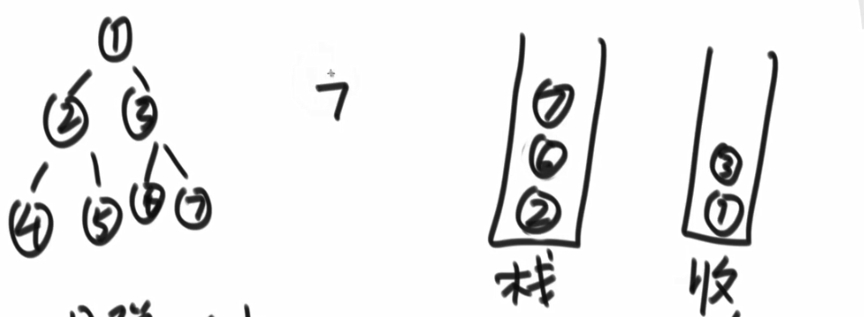

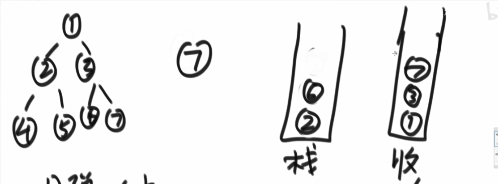


* ### 流程分析

头，左，右

1）弹出一个结点，记为cur

2）把当前结点放到 “==收集栈==” 里去，

3）先压左再压右 

4）周而复始

* ### 代码实现

```JAVA
public static void posOrderUnRecur1(Node head) {
		System.out.print("pos-order: ");
		if (head != null) {
			Stack<Node> s1 = new Stack<Node>();
			Stack<Node> s2 = new Stack<Node>();
			s1.push(head);
            
			while (!s1.isEmpty()) {
				head = s1.pop();
				s2.push(head);
                //先左
				if (head.left != null) {
					s1.push(head.left);
				}
                //再右
				if (head.right != null) {
					s1.push(head.right);
				}
			}
            //把收集栈s2的全部倒出来，即为后序的样子
			while (!s2.isEmpty()) {
				System.out.print(s2.pop().value + " ");
			}
		}
		System.out.println();
	}
```


### 中序遍历

左，右，头

1）每颗子树，整棵树左边进栈，

2）依次弹出结点的过程中，打印，然后对每一个弹出的结点的右树进行重复


④弹出，它没右树，就继续弹出②


但是②有右树，把②的右树进程重复（⑤进去）


然后⑤弹出打印，重复⑤的右树，因为没有就啥也不干


①弹出后，把①的左边界都压入栈


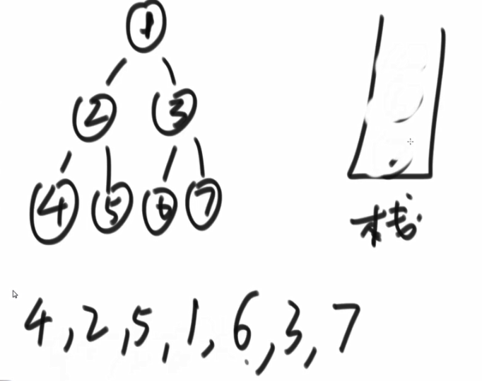

```JAVA
	public static void inOrderUnRecur(Node head) {
		System.out.print("in-order: ");
		if (head != null) {
			Stack<Node> stack = new Stack<Node>();
            // head != null 其实只在首次和最后一次有用，最后一次栈空了，刚好head经历最后一个 存在结点.right 变成了null
			while (!stack.isEmpty() || head != null) {
                // 逻辑分支1
				if (head != null) {
                    //这的head理解为当前结点，进栈，然后往左动，直到走到左侧的最低端null，停住
					stack.push(head);
					head = head.left;
				} else {
                    // 逻辑分支2：弹出打印看右边
					head = stack.pop();
					System.out.print(head.value + " ");
                    //走到右孩子，然后从 逻辑分支1 继续开始
					head = head.right; // 下轮就直接判断当前pop出的结点，若右树为null没有，则直接继续弹出再看新结点的右树有没有
				}
			}
		}
		System.out.println();
	}
```


其实没有`右`这个概念，每一个右其实都是一组子树的`左头右`


## 直观打印一颗二叉树

```JAVA
public class Code02_PrintBinaryTree {

	public static class Node {
		public int value;
		public Node left;
		public Node right;

		public Node(int data) {
			this.value = data;
		}
	}

	public static void printTree(Node head) {
		System.out.println("Binary Tree:");
		printInOrder(head, 0, "H", 17);
		System.out.println();
	}

	public static void printInOrder(Node head, int height, String to, int len) {
		if (head == null) {
			return;
		}
		printInOrder(head.right, height + 1, "v", len);
		String val = to + head.value + to;
		int lenM = val.length();
		int lenL = (len - lenM) / 2;
		int lenR = len - lenM - lenL;
		val = getSpace(lenL) + val + getSpace(lenR);
		System.out.println(getSpace(height * len) + val);
		printInOrder(head.left, height + 1, "^", len);
	}

	public static String getSpace(int num) {
		String space = " ";
		StringBuffer buf = new StringBuffer("");
		for (int i = 0; i < num; i++) {
			buf.append(space);
		}
		return buf.toString();
	}

	public static void main(String[] args) {
		Node head = new Node(1);
		head.left = new Node(-222222222);
		head.right = new Node(3);
		head.left.left = new Node(Integer.MIN_VALUE);
		head.right.left = new Node(55555555);
		head.right.right = new Node(66);
		head.left.left.right = new Node(777);
		printTree(head);

		head = new Node(1);
		head.left = new Node(2);
		head.right = new Node(3);
		head.left.left = new Node(4);
		head.right.left = new Node(5);
		head.right.right = new Node(6);
		head.left.left.right = new Node(7);
		printTree(head);

		head = new Node(1);
		head.left = new Node(1);
		head.right = new Node(1);
		head.left.left = new Node(1);
		head.right.left = new Node(1);
		head.right.right = new Node(1);
		head.left.left.right = new Node(1);
		printTree(head);

	}

}
```


## 二叉树的宽度优先遍历

1）头结点先放入

2）弹出就打印，然后先放左再放右

弄个队列

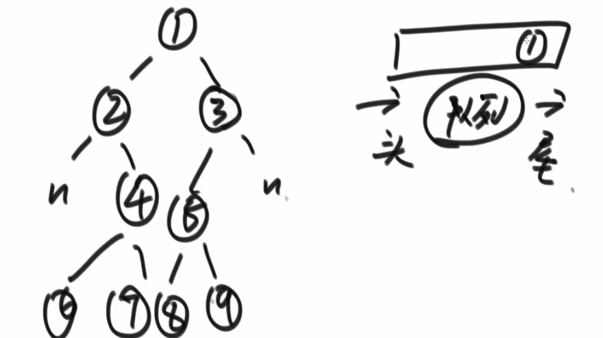


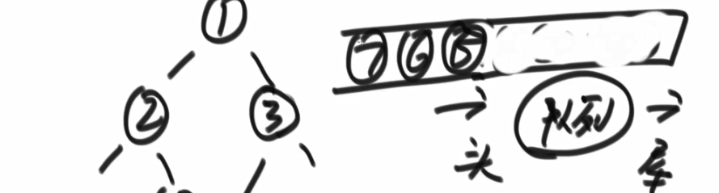


```java
public static void w(Node head){
    if(head == null) {
        return;
    }
    Queue<Node> queue = new LinkedList<>();
    queue.add(head);
    
    while(!queue.isEmpty()){
        Node cur = queue.poll();
        System.out.println(cur.value);
        
        if(cur.left != null) {
            queue.add(cur.left);
        }
        if(cur.right != null) {
            queue.add(cur.right);
        }
    }
}
```


### 例题：求二叉树的最大宽度

#### 利用哈希表来完成

初始状态


上图，②③进队列，同时在levelMap里面记录（②，2）和（③，2）


```java
public static void w(Node head){
    if(head == null) {
        return;
    }
    Queue<Node> queue = new LinkedList<>();
    queue.add(head);
    HashMap<Node,Integer> levelMap = new HashMap<>();
    level.put(head, 1);
    int curLevel = 1;// 记录当前即将开始（想）统计哪一层
    int curLevelNodes = 0; // 记录当前发现了多少个结点，弹出才开始发现
    int max = Integer.MIN_VALUE;
    
    while(!queue.isEmpty()){
        Node cur = queue.poll();
        int curNodeLevel = levelMap.get(cur);// 获取目前结点的对应层数
        if(curNodeLevel == curLevel) {
            curLevelNodes++;
        } else {// 现在的当前结点到了下一层，上一层已经找完了
            max = Math.max(max,curLevelNodes);//清算当前最大宽度
            curLevel++;
            curLevelNodes = 1;//发现了下一层的第一个结点
            
        }
        
        if(cur.left != null) {
            levelMap.put(cur.left, curNodeLevel+1);
            queue.add(cur.left);
        }
        if(cur.right != null) {
            levelMap.put(cur.right, curNodeLevel+1);
            queue.add(cur.right);
        }
    }
}
```

#### 不用哈希表来完成

仍然也用队列

初始情况

Node curend = ①：当前层最后一个结点

Node nextend = null：下一层最后一个结点

int curlevelNode = 0；（下图中curlevel应该改为curlevelNode）

max ：全局变量


① 结点进队列


①出去，让左孩子②进去，看nextend是不是null。如果为空则设置成当前进队列的结点；再让右孩子进队列。（总保持nextend和当前进队列的结点同步）


```JAVA
public static void f(Node head) {
    if(head == null){ return; }
    
    int max = Integer.MIN_VALUE;
    int curLevelNodes = 0;
    Node curEnd = head;// 开始走第一层前，得先知道当前层的最后一个结点
    Node nextEnd = null;//再下一层的最后一个结点
    Queue<Node> queue = new LinkedList<Node>();
    
    while(!queue.isEmpty){
        // 1.逐层走，走一层看下一层，走完一层停一层
        do{ //如果用while条件式的话，第一次curEnd == head 就进不来循环体
            head = queue.poll();
            
            if(head.left != null){
                queue.add(head.left);
                nextEnd = head.left;
            }
            if(head.right != null){
                queue.add(head.right);
                nextEnd = head.right;
            }
            
            curLevelNodes ++;
            //第一次走结束到这（就poll一次结点1）
            //curEnd = 结点1
            //nextEnd = 结点3
            //curLevelNodes = 1
            
            //此时 curEnd 匹配上了(内存地址)  当前队列中弹出的 结点1
            //跳出while(curEnd != head)这层循环
        } while(curEnd != head)
        
        // 2. 走完一层，就跳出循环，统计全局最大max
        max = Math.max(max,curLevelNodes);
        
        // 3. 更新（通常while循环都会有这么一步，控制条件的继续向下演变）
        curEnd = nextEnd;//走下一层前（即将变成当前层），得知道新的当前的最后一个结点（就是上一次走的时候的nextEnd）
        nextEnd = null;// 出队列，孩子先左后右的找，才能慢慢更新出最终的nextEnd(当一层遍历完，也就是跳出上面的while循环的时候)
        curLevelNodes = 0;
    }
}
```


## 判断搜索二叉树


**特点：**中序遍历，依次遍历得到的结果是==递增的==。

###  方法1：牛点点的，递归+动态比较

```java
public class TestBST {
    public static class Node {
        public int value;
        public Node left;
        public Node right;
    }
    
    public static int preValue = Integer.MIN_VALUE;
    //类型从void修改为boolean类型
    public static boolean checkBST(Node head) {
        if(head == null) {
            return true;
        }
        // 1. head的左边看看
        boolean isLeftBst = checkBST(head.left);
        
        if(!isLeftBst){// 左数都不是搜索二叉树那整颗数也肯定不是
            return false;
        }
        
        // 2. 左边看完，回到head
        if(head.value <= preValue){// preValue此时是处理完了左树
        	return false;
        } else {
            preValue = head.value;// 那就更新一下
        }
        
        // 3. head的右边看看
        return checkBST(head.right);//直接return就行，不用弄个isRightBst 记录
    }
    

    
    
    
}
```

### 方法2：傻多点的 递归+最终遍历比较

```JAVA
//方法二：傻多点的 递归+最终遍历比较
//方法二开始
/**
	把所有结点中序遍历放入inOrderList，再看是不是递增的
*/
public static boolean checkBST2(Node head) {
	if (head == null) {
		return true;
	}
	LinkedList<Node> inOrderList = new LinkedList<>();
	process(head, inOrderList);
	int pre = Integer.MIN_VALUE;
	for (Node cur : inOrderList) {
		if (pre >= cur.value) {
			return false;
		}
		pre = cur.value;
	}
	return true;
}

public static void process(Node node, LinkedList<Node> inOrderList) {
	if (node == null) {
		return;
	}
	process(node.left, inOrderList);
	inOrderList.add(node);
	process(node.right, inOrderList);
}
//方法二结束
```

### 方法3：非递归

```java
//方法三：非递归
    public static boolean checkBST3(Node head) {
		System.out.print("in-order: ");
		if (head != null) {
            
            int preValue = Integer.MIN_VALUE;
            
			Stack<Node> stack = new Stack<Node>();
			while (!stack.isEmpty() || head != null) {
				if (head != null) {
					stack.push(head);
					head = head.left;
				} else {
					head = stack.pop();
                    if(head.value <= preValue) {
						return false;
                    } else {
                        preValue = head.value;
                    }
                    head = head.right;
				}
			}
		}
		return true;
    }
```


方法一和方法三是类似的，只是一个是递归另一个非递归，共同点都是改变原来中序搜索中的`打印结点`的动作，修改为跟全局变量==preValue==比较的一个判断


### 方法四：套路法（递归）

该套路，解决一切在数上的动态规划问题：==数型DP==（面试二叉树最难类型）


左树需要 判断其是否是搜索二叉树 和 其 max 值，

右树需要 判断其是否是搜索二叉树 和 其 min 值，

然而，递归过程的动作是一样的，不分左右树，因此我们在递归中找并集，

因此，要从任意子树（不分左右），都要提供 3 个信息，是否是搜索二叉树、其 max 值、其 min 值。


```java
public class Code04_IsBST {

	public static class Node {
		public int value;
		public Node left;
		public Node right;

		public Node(int data) {
			this.value = data;
		}
	}
    // 规定返回值的类型
    public static class ReturnData{
        public boolean isBST;
        public int min;
        public int max;
        public ReturnData(boolean is, int mi, in ma){
            isBST = is;
            min = mi;
            max = ma;
        }
    }
	// 递归过程
    public static ReturnData process(Node x){
        if(x == null) { // base case
            return null
        }
        
        ReturnData leftData = process(x.left);
        ReturnData rightData = process(x.right);
        
        int min = x.value;
        int max = x.value;       
        if(leftData != null){ // 左树不为空
            min = Math.min(min, leftData.min);
            max = Math.max(max, leftData.max)
        }
        
        if(rightData != null){ // 右树不为空
            min = Math.min(min, rightData.min);
            max = Math.max(max, rightData.max);
        }        
        boolean isBST = true;// 先认为是true，再看会不会违规
        //下面都是各种违规情况
        if(leftData != null && (!leftData.isBST || leftData.max >= x.value)) {
            isBST = false;
        }
        if(rightData != null && (!rightData.isBST || x.value >= rightData.min)) {
            isBST = false;
        }
        
        // boolean isBST = false;
        // if(
        	// (leftData != null ? (leftData.isBST && leftData.max < x.value) : true)
            // &&
            // (righData != null ? (rightData.isBST && rightData.min > x.value) : true){
                // isBST = true;
            // }
        // )
        
        
        return new ReturnData(isBST,min,max);
    }

}
```


## 判断完全二叉树


每层都尽可能满的，最后一层即使不是满的，也是从左到右依次连接的

**判断方式**：按宽度遍历，

1）任一结点，有右孩子无左孩子则返回false（则不是左→右依次生长）

2）在1）不违规的条件下，如果遇到第一个左右孩子不双全的情况下。

后续的结点都必须是叶结点，否则就不是完全二叉树。

```java
public class Code05_IsCBT {

	public static class Node {
		public int value;
		public Node left;
		public Node right;

		public Node(int data) {
			this.value = data;
		}
	}

	public static boolean isCBT(Node head) {
		if (head == null) {
			return true;
		}
		LinkedList<Node> queue = new LinkedList<>();
        //是否遇到过左右两个孩子不双全的结点
		boolean leaf = false;//遇到了就变成true，类似一件事件是否发生的开关的作用
		Node l = null;
		Node r = null;
		queue.add(head);
		while (!queue.isEmpty()) {
			head = queue.poll();
			l = head.left;
			r = head.right;
            //重点部分的开始
			if (
                (leaf && (l != null || r != null)) //条件2）
                || 
                (l == null && r != null)//条件1）
            ) {
				return false;
			}
            //重点部分的结束
			if (l != null) {
				queue.add(l);
			}
			if (r != null) {
				queue.add(r);
			} 
            if (l == null || r == null) {
				leaf = true;//遇到了就一直是true了
			}
		}
		return true;
	}

}
```

**总结：**

​		前面一直用条件①来判断，当遇到 leaf 变成 true 的时候，就取决于条件②，此时条件②不成立时（也就是||后半部分不成立），那么条件①必然是不成立的。

## 判断满二叉树

**判断方式一**：结点个数N和最大深度L，满足 N = $2^L$ - 1 

```java
public static boolean isF(Node head){
	if(head == null) {
		return true;
	}
	//主函数isF来收取信息
	Info data = process(head);
	
	return data.nodes == (1 << data.height - 1);
}

public static class Info{
	public int height;
	public int nodes;
	
	public Info(int h, int n){
		height = h;
		nodes = n;
	}
}

public static Info process(Node x){ 
	if(x == null) {
		return new Info(0,0);
	}
	
	Info leftData = process(x.left);
	Info rightData = process(x.right);
	int height = Matb.max(leftData, rightData) + 1;
	int nodes = leftData.nodes + rightData.nodes + 1;
	
	
	return new Info(height,nodes);
}
```


## 判断平衡二叉树（二叉树题目套路）


任一个子树来说，其左树和右树的高度差，不超过1

```java
public class Code06_IsBalancedTree {

	public static class Node {
		public int value;
		public Node left;
		public Node right;

		public Node(int data) {
			this.value = data;
		}
	}

	public static boolean isBalanced(Node head) {
		return process(head).isBalanced;
	}
	
    //自定义一个返回值类型，包含了两个字段
	public static class ReturnType {
		public boolean isBalanced;
		public int height;

		public ReturnType(boolean isB, int hei) {
			isBalanced = isB;
			height = hei;
		}
	}

	public static ReturnType process(Node x) {
		if (x == null) { // 空树
			return new ReturnType(true, 0);
		}
        
		ReturnType leftData = process(x.left);
		ReturnType rightData = process(x.right);
        
		int height = Math.max(leftData.height, rightData.height) + 1;
        //整棵树是否平衡：根结点左子树平衡、根结点右子树平衡、左右子树的高度差不超过1。
		boolean isBalanced = leftData.isBalanced && rightData.isBalanced
				&& Math.abs(leftData.height - rightData.height) < 2;
        
		return new ReturnType(isBalanced, height);
	}

}
```

## 习题

### 例题1：找公共祖先结点


```java
package class05;

import java.util.HashMap;
import java.util.HashSet;

public class Code07_LowestCommonAncestor {

	public static class Node {
		public int value;
		public Node left;
		public Node right;

		public Node(int data) {
			this.value = data;
		}
	}
    // 方法一开始
    
    // o1和o2 一定属于head为头的数
    // 在上述前提下，返回o1和o2的共同祖先
    public static Node lca((Node head, Node o1, Node o2) {
        HashMap<Node, Node> fatherMap = new HashMap<>();
        fatherMap.put(head, head);
        process(head, fatherMap);
        HashSet<Node> set1 = new HashSet<>();
        
        Node cur = o1;
        // 1. 一直从下往上窜到头结点位置
        while(cur != father.get(cur)) { //只有头结点才会等于自己的父
        	set1.add(cur);
        	cur = fatherMap.get(cur);
        }
        //上面循环过程结束后，把头结点补充到这个set链条上
        set1.add(head);
        // 2. 接下来弄o2，没上窜一个都检查有没有在o1的链条里，从而找到第一次出现的共同祖先
        cur = o2;
        while(!set1.contains(cur)) {
            cur = father.get(cur);
        }
        return cur;
    }
    //把结点和其对应的父节点的K-V对放入HashMap里去                       
    public static void process(Node head, HashMap<Node, Node> fatherMap) {
    if(head == null) {
    	return;
    }
    fatherMap.put(head.left, head);
    fatherMap.put(head.right, head);
    process(head.left, fatherMap);
    process(head.right, fatherMap);
    }
    // 方法一结束
    
    //方法二开始                       
	public static Node lowestAncestor(Node head, Node o1, Node o2) {
		if (head == null || head == o1 || head == o2) { // base case
			return head;
		}
		Node left = lowestAncestor(head.left, o1, o2);
		Node right = lowestAncestor(head.right, o1, o2);
		if (left != null && right != null) {
			return head;
		}
		return left != null ? left : right;
	}
    //方法二结束
}

```

### 例题2：在二叉树中找到一个结点的后继结点


==后继结点：==中序遍历中，一个结点的下一个结点。


D的后继结点是B，B的后继结点是E，E的后继结点是A


==优化的方法==


1）x 有右树的时候，x的后继就是 右树上的的==最左结点==

2）x 无右树，x 一直往上走，直到找到一个结点是他==父节点的左孩子==

3）考虑整个树的右树的最右的结点，他没有后继，他的后继是个null

```java
public class Code08_SuccessorNode {

	public static class Node {
		public int value;
		public Node left;
		public Node right;
		public Node parent;

		public Node(int data) {
			this.value = data;
		}
	}

	public static Node getSuccessorNode(Node node) {
		if (node == null) {
			return node;
		}
		if (node.right != null) {
			return getLeftMost(node.right);
		} else { //无右树
			Node parent = node.parent;
			while (parent != null && parent.left != node) { // 当前结点是其父亲结点的右孩子
				node = parent;
				parent = node.parent;
			}
			return parent;
		}
	}
	//整个树上的最左结点
	public static Node getLeftMost(Node node) {
		if (node == null) {
			return node;
		}
		while (node.left != null) {
			node = node.left;
		}
		return node;
	}
}
```


### 例题3：二叉树的序列化和反序列化


==序列化==：由内存变成字符串，可以查看和修改对象

==反序列化==：字符串变成内存，藏起来看不见了


上图采取先序遍历进行演示，

下划线_：表示一个字符的结束

特殊字符#：表示null

```JAVA
public class Code09_SerializeAndReconstructTree {

	public static class Node {
		public int value;
		public Node left;
		public Node right;

		public Node(int data) {
			this.value = data;
		}
	}
    // 以 head 为头的数，请序列化成字符串返回
	// 先序遍历序列化
	public static String serialByPre(Node head) {
		if (head == null) {
			return "#!";
		}
		String res = head.value + "!";
		res += serialByPre(head.left);
		res += serialByPre(head.right);
		return res;
	}

	public static Node reconByPreString(String preStr) {
		String[] values = preStr.split("!");
		Queue<String> queue = new LinkedList<String>();
		for (int i = 0; i != values.length; i++) {
			queue.offer(values[i]);
		}
		return reconPreOrder(queue);
	}

	public static Node reconPreOrder(Queue<String> queue) {
		String value = queue.poll();
		if (value.equals("#")) {
			return null;
		}
		Node head = new Node(Integer.valueOf(value));
		head.left = reconPreOrder(queue);
		head.right = reconPreOrder(queue);
		return head;
	}
	public static String serialByLevel(Node head) {
		if (head == null) {
			return "#!";
		}
		String res = head.value + "!";
		Queue<Node> queue = new LinkedList<Node>();
		queue.offer(head);
		while (!queue.isEmpty()) {
			head = queue.poll();
			if (head.left != null) {
				res += head.left.value + "!";
				queue.offer(head.left);
			} else {
				res += "#!";
			}
			if (head.right != null) {
				res += head.right.value + "!";
				queue.offer(head.right);
			} else {
				res += "#!";
			}
		}
		return res;
	}

	public static Node reconByLevelString(String levelStr) {
		String[] values = levelStr.split("!");
		int index = 0;
		Node head = generateNodeByString(values[index++]);
		Queue<Node> queue = new LinkedList<Node>();
		if (head != null) {
			queue.offer(head);
		}
		Node node = null;
		while (!queue.isEmpty()) {
			node = queue.poll();
			node.left = generateNodeByString(values[index++]);
			node.right = generateNodeByString(values[index++]);
			if (node.left != null) {
				queue.offer(node.left);
			}
			if (node.right != null) {
				queue.offer(node.right);
			}
		}
		return head;
	}

	public static Node generateNodeByString(String val) {
		if (val.equals("#")) {
			return null;
		}
		return new Node(Integer.valueOf(val));
	}

	// for test -- print tree
	public static void printTree(Node head) {
		System.out.println("Binary Tree:");
		printInOrder(head, 0, "H", 17);
		System.out.println();
	}

	public static void printInOrder(Node head, int height, String to, int len) {
		if (head == null) {
			return;
		}
		printInOrder(head.right, height + 1, "v", len);
		String val = to + head.value + to;
		int lenM = val.length();
		int lenL = (len - lenM) / 2;
		int lenR = len - lenM - lenL;
		val = getSpace(lenL) + val + getSpace(lenR);
		System.out.println(getSpace(height * len) + val);
		printInOrder(head.left, height + 1, "^", len);
	}

	public static String getSpace(int num) {
		String space = " ";
		StringBuffer buf = new StringBuffer("");
		for (int i = 0; i < num; i++) {
			buf.append(space);
		}
		return buf.toString();
	}    
}    
```


### 例题4：傻逼的折纸问题


```java
public class Code10_PaperFolding {

	public static void printAllFolds(int N) {
		printProcess(1, N, true);
	}

	// 递归过程，当前来到了某一个结点
	// i是结点的层数，N是一共的层数， down == true 凹折痕，down == false 凸折痕
	public static void printProcess(int i, int N, boolean down) {
		if (i > N) {
			return;
		}
		/**
		如图所示
		①凹，先调②凹；②凹继续先调③凹，类似二叉树的 cur.left
		*/
		printProcess(i + 1, N, true);
		System.out.println(down ? "凹 " : "凸 ");
		printProcess(i + 1, N, false);
	}

	public static void main(String[] args) {
		int N = 1;
		printAllFolds(N);
	}
}

```


# 五、图

==遇到的题，都将信息转换成模板的形式，来create一个模板的图==

## 图的构成部分

### 1）结点Node

```java
public class Node {
	public int value;
	public int in;
	public int out;
	public ArrayList<Node> nexts;
	public ArrayList<Edge> edges;

	public Node(int value) {
		this.value = value;
		in = 0;
		out = 0;
		nexts = new ArrayList<>();
		edges = new ArrayList<>();
	}
}
```


### 2）边，edge

```java
public class Edge {
	public int weight;
	public Node from;
	public Node to;

	public Edge(int weight, Node from, Node to) {
		this.weight = weight;
		this.from = from;
		this.to = to;
	}
}
```


### 3) 图，graph

```java
public class Graph {
	public HashMap<Integer,Node> nodes;
	public HashSet<Edge> edges;

	public Graph() {
		nodes = new HashMap<>();
		edges = new HashSet<>();
	}
}
```


## 图的模板生成器

```JAVA
public class GraphGenerator {

	public static Graph createGraph(Integer[][] matrix) {
		Graph graph = new Graph();
		for (int i = 0; i < matrix.length; i++) {
			Integer weight = matrix[i][0];
			Integer from = matrix[i][1];
			Integer to = matrix[i][2];
			if (!graph.nodes.containsKey(from)) {
				graph.nodes.put(from, new Node(from));
			}
			if (!graph.nodes.containsKey(to)) {
				graph.nodes.put(to, new Node(to));
			}
			Node fromNode = graph.nodes.get(from);
			Node toNode = graph.nodes.get(to);
			Edge newEdge = new Edge(weight, fromNode, toNode);
			fromNode.nexts.add(toNode);
			fromNode.out++;
			toNode.in++;
			fromNode.edges.add(newEdge);
			graph.edges.add(newEdge);
		}
		return graph;
	}

}
```

## ① 宽度优先遍历，BFS


```JAVA
public class Code01_BFS {

	public static void bfs(Node node) {
		if (node == null) {
			return;
		}
        // 用set的目的是，让node不会重复的进入队列queue
        // 这个set使得遍历的时候不会出现环or重复。
		Queue<Node> queue = new LinkedList<>();
		HashSet<Node> set = new HashSet<>();
		queue.add(node);
		set.add(node);
		while (!queue.isEmpty()) {
			Node cur = queue.poll();
            //打印的语句，就是实际对结点进行操作的位置
			System.out.println(cur.value);
            //实现宽度优先遍历
			for (Node next : cur.nexts) {
				if (!set.contains(next)) {
					set.add(next);
					queue.add(next);
				}
			}
		}
	}

}
```


## ② 深度优先遍历，DFS


```JAVA
public class Code02_DFS {

	public static void dfs(Node node) {
		if (node == null) {
			return;
		}
		Stack<Node> stack = new Stack<>();
		HashSet<Node> set = new HashSet<>();
		stack.add(node);
		set.add(node);
        //打印的语句，就是实际对结点进行操作的位置
        //出发前就先进行处理
		System.out.println(node.value);
		while (!stack.isEmpty()) {
			Node cur = stack.pop();
			for (Node next : cur.nexts) {
				if (!set.contains(next)) {
                    //一旦发现某条路没走过，就逮着他先走完
					stack.push(cur);
					stack.push(next);
					set.add(next);
                    //打印的语句，就是实际对邻居结点进行操作的位置
					System.out.println(next.value);
					break;
				}
			}
		}
	}
}
```


## ③ 拓补排序算法

有向图中，依次找到入度为0的点。

```JAVA
public class Code03_TopologySort {

	// directed graph and no loop
	public static List<Node> sortedTopology(Graph graph) {
        // key：某一个node
        // value：剩余的入度
		HashMap<Node, Integer> inMap = new HashMap<>();
		// 入度为0的点，才能进这个队列
        Queue<Node> zeroInQueue = new LinkedList<>();
		for (Node node : graph.nodes.values()) {
            // 记录每个结点和其入度
			inMap.put(node, node.in);
			if (node.in == 0) {
				zeroInQueue.add(node);
			}
		}
        // 拓补排序的结果，依次加入result
		List<Node> result = new ArrayList<>();
		while (!zeroInQueue.isEmpty()) {
			Node cur = zeroInQueue.poll();
			result.add(cur);
            // 擦除cur对其他节点入度的影响
			for (Node next : cur.nexts) {
				inMap.put(next, inMap.get(next) - 1);
                //把新得到入度为0的，加入
				if (inMap.get(next) == 0) {
					zeroInQueue.add(next);
				}
			}
		}
		return result;
	}
}
```


## ④ 无向图的算法

### kruskal算法


最小生成树，保证连通性，但不一定所有的边都要，权值累加和是所有方案中最小的。

==算法的出发点==：所有的边排完序，优先选择最小的边

​						考虑某条边，若不形成环，则加上；若会形成环，则不加。


#### 例子举例：


假设，一开始所有的点都是不连通的。

加入一条边，看会不会成环，就看这条边的from和to是不是在一个集合里


A-C 连起来后，不成环，可以加，那么 A C的集合就要==并==在一起。


同理，A C D ==并== 到一个集合里。


同理，A C D B ==并== 到一个集合里。


欲加A-D，但发现边A-D的from A和 to D在同一个集合里，故==不要==

同理，B-D 也不要


然后B–E加上去

#### 部分代码

```JAVA
public class Kruskal {
	

	public static class MySets{
		
		public HashMap<Node, List<Node>> setMap;
		
		public MySets(List<Node> nodes) {
			for(Node cur : nodes) {
				//对应初始，每个结点都在一个单独的集合里
				List<Node> set = new ArrayList<>();
				set.add(cur);
				setMap.put(cur,set);
			}
		}
		
		public boolean isSameSet(Node from, Node to){
			List<Node> fromSet = setMap.get(from);
			List<Node> toSet = setMap.get(to);
			// 如果内存地址是一个则是一个集合
			return fromSet == toSet;
		}
		
		pubilc void union(Node from, Node to){
			List<Node> fromSet = setMap.get(from);
			List<Node> toSet = setMap.get(to);
			
			// to中所有的 node 都放到from里去
			for(Node toNode : toSet){
				fromSet.add(toNode);
				setMap.put(toNode,fromSet);
			}
		}
		
		public static Set<Edge> kruskalMST(Graph graph) {
		UnionFind unionFind = new UnionFind();
		unionFind.makeSets(graph.nodes.values());
		PriorityQueue<Edge> priorityQueue = new PriorityQueue<>(new EdgeComparator());
		for (Edge edge : graph.edges) { // M 条边
			priorityQueue.add(edge);	// O(logM)
		}
		Set<Edge> result = new HashSet<>();
		while (!priorityQueue.isEmpty()) {	// M 条边
			Edge edge = priorityQueue.poll(); // O(logM)
			if (!unionFind.isSameSet(edge.from, edge.to)) { // O(1)
				result.add(edge);
				unionFind.union(edge.from, edge.to);
			}
		}
		return result;
	}
	}
	
}
```


### prim算法


从点的角度思考，不像Kruskal是从边的角度出发

```JAVA
// undirected graph only
public class Code05_Prim {
	// 自定义一个比较器，规则是从 小 -> 大
	public static class EdgeComparator implements Comparator<Edge> {

		@Override
		public int compare(Edge o1, Edge o2) {
			return o1.weight - o2.weight;
		}

	}

	public static Set<Edge> primMST(Graph graph) {
		// 解锁的边进入小根堆
		PriorityQueue<Edge> priorityQueue = new PriorityQueue<>(
				new EdgeComparator());
				
		HashSet<Node> set = new HashSet<>(); // 依次挑选的边在result里
		Set<Edge> result = new HashSet<>();
		for (Node node : graph.nodes.values()) { // 随便挑了一个点
			if (!set.contains(node)) {
				set.add(node);
				for (Edge edge : node.edges) { // 由一个点，解锁所有相连的边
					priorityQueue.add(edge);
				}
				while (!priorityQueue.isEmpty()) {
					Edge edge = priorityQueue.poll(); // 弹出解锁的边中，最小的边
					Node toNode = edge.to; // 可能的一个新的点
					if (!set.contains(toNode)) { // 不含有的时候，就是新的点
						set.add(toNode);
						result.add(edge);
						for (Edge nextEdge : toNode.edges) {
							priorityQueue.add(nextEdge);
						}
					}
				}
			}
		}
		return result;
	}

	// 请保证graph是连通图
	// graph[i][j]表示点i到点j的距离，如果是系统最大值代表无路
	// 返回值是最小连通图的路径之和
	public static int prim(int[][] graph) {
		int size = graph.length;
		int[] distances = new int[size];
		boolean[] visit = new boolean[size];
		visit[0] = true;
		for (int i = 0; i < size; i++) {
			distances[i] = graph[0][i];
		}
		int sum = 0;
		for (int i = 1; i < size; i++) {
			int minPath = Integer.MAX_VALUE;
			int minIndex = -1;
			for (int j = 0; j < size; j++) {
				if (!visit[j] && distances[j] < minPath) {
					minPath = distances[j];
					minIndex = j;
				}
			}
			if (minIndex == -1) {
				return sum;
			}
			visit[minIndex] = true;
			sum += minPath;
			for (int j = 0; j < size; j++) {
				if (!visit[j] && distances[j] > graph[minIndex][j]) {
					distances[j] = graph[minIndex][j];
				}
			}
		}
		return sum;
	}

	public static void main(String[] args) {
		System.out.println("hello world!");
	}

}

```

### Dijkstra算法


一定要规定出发点。


#### 算法流程


刚开始，出发点到自己的距离为==0==，到其他点的距离为==正无穷==

每一次，都在表中寻找**距离最短的点**。然后看这个点的出发的后续边，能不能让这张表的某些记录变得更少（比如，某个数变得更小 或者 正无穷变成某个具体的数）。


到此为止，A已经榨干了，从此锁死A点不再使用。接下来看B


到此为止，B锁死。接下来看C，再D、E。。。


```JAVA
// no negative weight
public class Code06_Dijkstra {

	public static HashMap<Node, Integer> dijkstra1(Node head) {
		// 从head出发到所有点的最小距离
		// key：从head出发到达key
		// value：从head出发到达key的最小距离
		// 如果在表中，没有T的记录，含义是从head（源头）出发到T这个点的距离为正无穷
		HashMap<Node, Integer> distanceMap = new HashMap<>();
		distanceMap.put(head, 0);// 初始化源头
		
		// 已经求过距离的结点，存在selectedNodes中，以后再也不碰
		HashSet<Node> selectedNodes = new HashSet<>();
		// 该方法的作用：在distanceMap中找一个最小的记录，但是这个点不能在selectedNodes中
		Node minNode = getMinDistanceAndUnselectedNode(distanceMap, selectedNodes);
		while (minNode != null) {
			int distance = distanceMap.get(minNode);
			for (Edge edge : minNode.edges) { // 遍历当前点出发的所有边
				Node toNode = edge.to;
				if (!distanceMap.containsKey(toNode)) { // distanceMap里没记录，即到当前这个点的距离是正无穷
					distanceMap.put(toNode, distance + edge.weight);// 新增距离
				} else {
					// 更新距离
					// min（之前的最小距离，新路径的距离）
					distanceMap.put(edge.to, Math.min(distanceMap.get(toNode), distance + edge.weight));
				}
			}
			// 如果让一个原来无路的有路了就add
			selectedNodes.add(minNode);
			// 更新，又选出个结点用于下次寻找
			minNode = getMinDistanceAndUnselectedNode(distanceMap, selectedNodes);
			// 最后会无节点可选，然后上面的minNode就变成了null，从而跳出while循环
		}
		return distanceMap;
	}

	public static Node getMinDistanceAndUnselectedNode(HashMap<Node, Integer> distanceMap, 
			HashSet<Node> touchedNodes) {
		Node minNode = null;
		int minDistance = Integer.MAX_VALUE;
		for (Entry<Node, Integer> entry : distanceMap.entrySet()) {
			Node node = entry.getKey();
			int distance = entry.getValue();
			// 这个点必须是没touch的，就是先前说的没有锁掉的
			if (!touchedNodes.contains(node) && distance < minDistance) {
				minNode = node;
				minDistance = distance;
			}
		}
		return minNode;
	}

	public static class NodeRecord {
		public Node node;
		public int distance;

		public NodeRecord(Node node, int distance) {
			this.node = node;
			this.distance = distance;
		}
	}

	public static class NodeHeap {
		private Node[] nodes;
		private HashMap<Node, Integer> heapIndexMap;
		private HashMap<Node, Integer> distanceMap;
		private int size;

		public NodeHeap(int size) {
			nodes = new Node[size];
			heapIndexMap = new HashMap<>();
			distanceMap = new HashMap<>();
			this.size = 0;
		}

		public boolean isEmpty() {
			return size == 0;
		}

		public void addOrUpdateOrIgnore(Node node, int distance) {
			if (inHeap(node)) {
				distanceMap.put(node, Math.min(distanceMap.get(node), distance));
				insertHeapify(node, heapIndexMap.get(node));
			}
			if (!isEntered(node)) {
				nodes[size] = node;
				heapIndexMap.put(node, size);
				distanceMap.put(node, distance);
				insertHeapify(node, size++);
			}
		}

		public NodeRecord pop() {
			NodeRecord nodeRecord = new NodeRecord(nodes[0], distanceMap.get(nodes[0]));
			swap(0, size - 1);
			heapIndexMap.put(nodes[size - 1], -1);
			distanceMap.remove(nodes[size - 1]);
			nodes[size - 1] = null;
			heapify(0, --size);
			return nodeRecord;
		}

		private void insertHeapify(Node node, int index) {
			while (distanceMap.get(nodes[index]) < distanceMap.get(nodes[(index - 1) / 2])) {
				swap(index, (index - 1) / 2);
				index = (index - 1) / 2;
			}
		}

		private void heapify(int index, int size) {
			int left = index * 2 + 1;
			while (left < size) {
				int smallest = left + 1 < size && distanceMap.get(nodes[left + 1]) < distanceMap.get(nodes[left])
						? left + 1 : left;
				smallest = distanceMap.get(nodes[smallest]) < distanceMap.get(nodes[index]) ? smallest : index;
				if (smallest == index) {
					break;
				}
				swap(smallest, index);
				index = smallest;
				left = index * 2 + 1;
			}
		}

		private boolean isEntered(Node node) {
			return heapIndexMap.containsKey(node);
		}

		private boolean inHeap(Node node) {
			return isEntered(node) && heapIndexMap.get(node) != -1;
		}

		private void swap(int index1, int index2) {
			heapIndexMap.put(nodes[index1], index2);
			heapIndexMap.put(nodes[index2], index1);
			Node tmp = nodes[index1];
			nodes[index1] = nodes[index2];
			nodes[index2] = tmp;
		}
	}

	public static HashMap<Node, Integer> dijkstra2(Node head, int size) {
		NodeHeap nodeHeap = new NodeHeap(size);
		nodeHeap.addOrUpdateOrIgnore(head, 0);
		HashMap<Node, Integer> result = new HashMap<>();
		while (!nodeHeap.isEmpty()) {
			NodeRecord record = nodeHeap.pop();
			Node cur = record.node;
			int distance = record.distance;
			for (Edge edge : cur.edges) {
				nodeHeap.addOrUpdateOrIgnore(edge.to, edge.weight + distance);
			}
			result.put(cur, distance);
		}
		return result;
	}

}
```


# 六、前缀树和贪心算法

## 介绍前缀树


==沿途的每一个p值++，最后一个点的e值++==


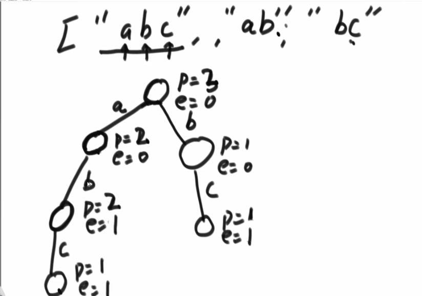


删除：


### 代码实现

```JAVA
package class07;

public class Code01_TrieTree {

	public static class TrieNode {
		public int pass;
		public int end;
		// HashMap<Char, Node> nexts;
		// TreeMap<Char, Node> nexts;
		public TrieNode[] nexts;

		public TrieNode() {
			pass = 0;
			end = 0;
			// nexts[0] == null 没有走向'a'的路
			// nexts[0] != null 有走向'a'的路
			// ...
			// nexts[25] != null 有走向'z'的路
			nexts = new TrieNode[26];
		}
	}

	public static class Trie {
		private TrieNode root;

		public Trie() {
			root = new TrieNode();
		}

		public void insert(String word) {
			if (word == null) {
				return;
			}
			char[] chs = word.toCharArray();
			TrieNode node = root;
			int index = 0;
			for (int i = 0; i < chs.length; i++) { // 从左往右遍历字符
				index = chs[i] - 'a'; // 由字符，对应成走向哪条路（对应到0·26）
				if (node.nexts[index] == null) { // 没有就新建
					node.nexts[index] = new TrieNode();
				}
				node = node.nexts[index];
				node.pass++;
			}
			// 最后到达结尾的点，end++
			node.end++;
		}

		public void delete(String word) {
			// 删前查一下，没有你删的得儿，只有abc，你删abcd，删到屁股发现没你这adcd
			// 那你把人家a b c 的 经过的node 都删掉了，毛病？
			if (search(word) != 0) {
				char[] chs = word.toCharArray();
				TrieNode node = root;
				int index = 0;
				for (int i = 0; i < chs.length; i++) {
					index = chs[i] - 'a';
					// --之后变成0了，那这个结点就应当被释放掉
					if (--node.nexts[index].pass == 0) {
						node.nexts[index] = null;
						return;
					}
					node = node.nexts[index];
				}
				node.end--;
			}
		}

		public int search(String word) {
			if (word == null) {
				return 0;
			}
			char[] chs = word.toCharArray();
			TrieNode node = root;
			int index = 0;
			for (int i = 0; i < chs.length; i++) {
				index = chs[i] - 'a';
				if (node.nexts[index] == null) {
					return 0;
				}
				node = node.nexts[index];
			}
			// 一路走下来，走到最后一个node，他的end就表示这个字符串出现几次
			return node.end;
		}

		public int prefixNumber(String pre) {
			if (pre == null) {
				return 0;
			}
			char[] chs = pre.toCharArray();
			TrieNode node = root;
			int index = 0;
			for (int i = 0; i < chs.length; i++) {
				index = chs[i] - 'a';
				if (node.nexts[index] == null) { // 没这字符肯定就0个字符串以他为前缀
					return 0;
				}
				node = node.nexts[index];
			}
			return node.pass;
		}
	}

	public static void main(String[] args) {
		Trie trie = new Trie();
		System.out.println(trie.search("zuo"));
		trie.insert("zuo");
		System.out.println(trie.search("zuo"));
		trie.delete("zuo");
		System.out.println(trie.search("zuo"));
		trie.insert("zuo");
		trie.insert("zuo");
		trie.delete("zuo");
		System.out.println(trie.search("zuo"));
		trie.delete("zuo");
		System.out.println(trie.search("zuo"));
		trie.insert("zuoa");
		trie.insert("zuoac");
		trie.insert("zuoab");
		trie.insert("zuoad");
		trie.delete("zuoa");
		System.out.println(trie.search("zuoa"));
		System.out.println(trie.prefixNumber("zuo"));
	}
}
```


## 介绍贪心算法


### 例题1:


 


### 例题2：字典序问题


==具备传递性==


乘以$K^2$​意味着abc向左移动两位。


 

==条件改写==


#### 证明过程：


### 代码

```JAVA
package class07;

import java.util.Arrays;
import java.util.Comparator;

public class Code02_LowestLexicography {

	public static class MyComparator implements Comparator<String> {
		@Override
		public int compare(String a, String b) {
			return (a + b).compareTo(b + a);
		}
	}

	public static String lowestString(String[] strs) {
		if (strs == null || strs.length == 0) {
			return "";
		}
		Arrays.sort(strs, new MyComparator());
		String res = "";
		for (int i = 0; i < strs.length; i++) {
			res += strs[i];
		}
		return res;
	}

	public static void main(String[] args) {
		String[] strs1 = { "jibw", "ji", "jp", "bw", "jibw" };
		System.out.println(lowestString(strs1));

		String[] strs2 = { "ba", "b" };
		System.out.println(lowestString(strs2));

	}

}

```


### 例题3：金条分割


```JAVA
public class Code03_LessMoneySplitGold {

	public static int lessMoney(int[] arr) {
		PriorityQueue<Integer> pQ = new PriorityQueue<>();
		for (int i = 0; i < arr.length; i++) {
			pQ.add(arr[i]);
		}
		int sum = 0;
		int cur = 0;
		while (pQ.size() > 1) {
			cur = pQ.poll() + pQ.poll();
			sum += cur;
			pQ.add(cur);
		}
		return sum;
	}

	public static class MinheapComparator implements Comparator<Integer> {

		@Override
		public int compare(Integer o1, Integer o2) {
			return o1 - o2; // < 0  o1 < o2  负数
		}

	}

	public static class MaxheapComparator implements Comparator<Integer> {

		@Override
		public int compare(Integer o1, Integer o2) {
			return o2 - o1; // <   o2 < o1
		}

	}

	public static void main(String[] args) {
		// solution
		int[] arr = { 6, 7, 8, 9 };
		System.out.println(lessMoney(arr));

		int[] arrForHeap = { 3, 5, 2, 7, 0, 1, 6, 4 };

		// min heap
		PriorityQueue<Integer> minQ1 = new PriorityQueue<>();
		for (int i = 0; i < arrForHeap.length; i++) {
			minQ1.add(arrForHeap[i]);
		}
		while (!minQ1.isEmpty()) {
			System.out.print(minQ1.poll() + " ");
		}
		System.out.println();

		// min heap use Comparator
		PriorityQueue<Integer> minQ2 = new PriorityQueue<>(new MinheapComparator());
		for (int i = 0; i < arrForHeap.length; i++) {
			minQ2.add(arrForHeap[i]);
		}
		while (!minQ2.isEmpty()) {
			System.out.print(minQ2.poll() + " ");
		}
		System.out.println();

		// max heap use Comparator
		PriorityQueue<Integer> maxQ = new PriorityQueue<>(new MaxheapComparator());
		for (int i = 0; i < arrForHeap.length; i++) {
			maxQ.add(arrForHeap[i]);
		}
		while (!maxQ.isEmpty()) {
			System.out.print(maxQ.poll() + " ");
		}

	}

}
```


### 例题4：

贪心策略：钱从小到多，每次都用最小的钱干最赚的活

圈圈内上面是项目消耗资金，下面是项目的利润

M 是初始资金，K 是处理的项目个数（串行的）


```java
import java.util.Comparator;
import java.util.PriorityQueue;

public class Code05_IPO {
	public static class Node {
		public int p;
		public int c;

		public Node(int p, int c) {
			this.p = p;
			this.c = c;
		}
	}

	public static class MinCostComparator implements Comparator<Node> {

		@Override
		public int compare(Node o1, Node o2) {
			return o1.c - o2.c;
		}

	}

	public static class MaxProfitComparator implements Comparator<Node> {

		@Override
		public int compare(Node o1, Node o2) {
			return o2.p - o1.p;
		}

	}

	public static int findMaximizedCapital(int k, int W, int[] Profits, int[] Capital) {
		Node[] nodes = new Node[Profits.length];
		for (int i = 0; i < Profits.length; i++) {
			nodes[i] = new Node(Profits[i], Capital[i]);
		}

		PriorityQueue<Node> minCostQ = new PriorityQueue<>(new MinCostComparator());
		PriorityQueue<Node> maxProfitQ = new PriorityQueue<>(new MaxProfitComparator());
		for (int i = 0; i < nodes.length; i++) {
            // 所有项目扔到被锁池中，花费组织的小根堆
			minCostQ.add(nodes[i]);
		}
		for (int i = 0; i < k; i++) { // 进行K轮
            // 能力所及的项目，全解锁	
			while (!minCostQ.isEmpty() && minCostQ.peek().c <= W) {
				maxProfitQ.add(minCostQ.poll());
			}
			if (maxProfitQ.isEmpty()) {
				return W;
			}
			W += maxProfitQ.poll().p;
		}
		return W;
	}

}

```


### 例题5：一个数据流中，随时可以取得的中位数


关于上图这个较大较小的说明，（==size大的弹出进入size小的那个==）

1）3 是 比 大根堆 堆顶 的 5 小，所以 他 直接 进入 大根堆。


​	此时，大根堆的大小是2，小根堆的大小是0，因此较大的超过较小的，且==size差==为2，因此大根堆堆顶 弹出， 进入 小根堆


2）7 是 比 大根堆 堆顶 3 大，所以 他 进入 小根堆

​	此时，size差没有达到2，故不作调整


3） 4 是 比 大根堆 堆顶 的 3 大，入 小根堆


此时 ==size差== 达到了 ==2==，小根堆堆顶弹出进入大根堆


<center><font color=red>重点：最终实现的效果</font>


从小到大，按照一半一半的位置分隔开成俩部分，前$\frac{n}{2}$​ 在大根堆，后$\frac{n}{2}$在小根堆里面。

偶数个是，是两个根相加除以2，奇数个是有唯一 一个中位数


### 例题6：N皇后问题


# 七、暴力递归


## 例题1：汉诺塔问题


## 例题2：全部子序列


```JAVA
public class Code02_PrintAllSubsquences {

	public static void printAllSubsquence(String str) {
		char[] chs = str.toCharArray();
		process(chs, 0);
	}
	// 方法一：
	// 当前来到i位置，要和不要，走两条路
	// 之前的选择，所形成的结果，是一个Str
	public static void process(char[] chs, int i) {
		if (i == chs.length) {
			System.out.println(String.valueOf(chs));
			return;
		}
		process(chs, i + 1); // 要当前的字符的路
		char tmp = chs[i];
		chs[i] = 0; // 记录下当前字符chsp[i], 再把他变成 0 ，那么接下来的process就是 不要当前字符的路
		process(chs, i + 1);
		
		chs[i] = tmp; // 再恢复原来的字符
	}
	
	public static void function(String str) {
		char[] chs = str.toCharArray();
		process(chs, 0, new ArrayList<Character>());
	}
	
	//方法二：与方法一是等效的
	// 当前来到i位置，要和不要，走两条路
	// res之前的选择，所形成的列表List
	public static void process(char[] chs, int i, List<Character> res) {
		if(i == chs.length) {
			printList(res);
		}
		List<Character> resKeep = copyList(res);
		resKeep.add(chs[i]);
		process(chs, i+1, resKeep); // 要当前的字符的路
		List<Character> resNoInclude = copyList(res);
		process(chs, i+1, resNoInclude); // 不要当前字符的路
	}
	
	public static void printList(List<Character> res) {
		// ...;
	}
	
	public static List<Character> copyList(List<Character> list){
		return null;
	}
	

	public static void main(String[] args) {
		String test = "abc";
		printAllSubsquence(test);
	}

}
```


## 例题3：打印一个字符串的全部排列


```java
```


